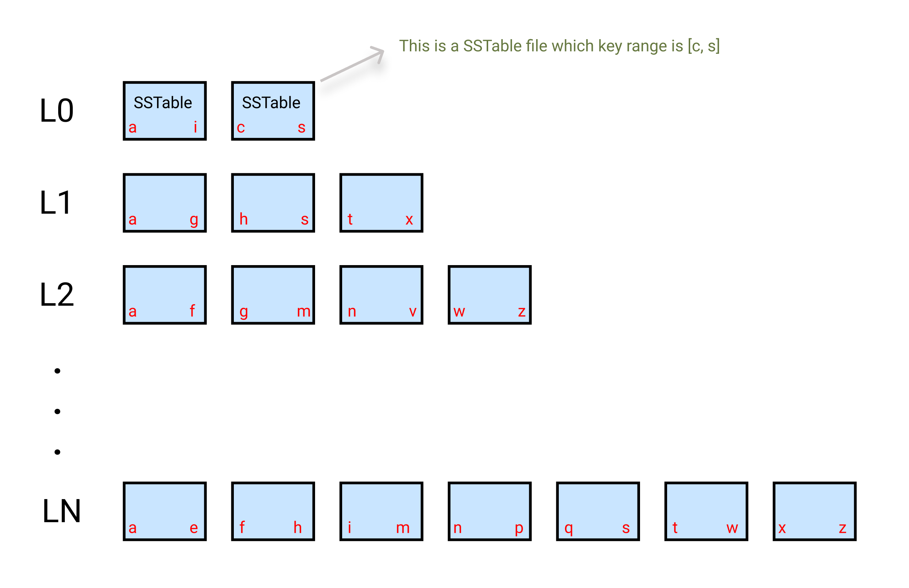

# 简介

LevelDB 是一个 key-value 持久化存储引擎，类似于单个 [Bigtable tablet (section 5.3)](http://research.google.com/archive/bigtable.html) 的实现。


LevelDB 提供了简洁的接口：`Put`，`Delete`， `Get`。


# 接口实现

## Put 

```c
Status DB::Put(const WriteOptions& opt, const Slice& key, const Slice& value) {
  WriteBatch batch;
  batch.Put(key, value);
  return Write(opt, &batch);
}
```

`Put` 接口内部将写入 key-value 封装成一个 `WriteBatch` 后，调用 `Write` 接口。

### WriteBatch

`WriteBatch` 将 key-value 存储到一个连续的 byte 数组里面，编码如下：


* sequence_number: 写入序列号，每次写入一个 key-value 后加 1 单调递增。
* count: 一个 `WriteBatch` 中写入 key-value 对的个数。
* type 是写入类型，有 2 种写入类型：
  * kTypeValue：写入 key-value 操作。
  * kTypeDeletion：删除 key 操作。其对应的 value_length 是0， value 是空。
* key_size: key 的大小，用`PutVarint32` 编码。
* key: 用户写入的 key 的值。
* value_size: value 的大小。
* value: 用户写入 value 的值。

可以使用 `WriteBatch` 一次写入多个 key-value 来提升写入性能。

### Write

简单的写入流程如下：

1. 检查是否需要 compaction
2. 分配 sequence
3. 写 WAL 日志。
4. 如果 `WriteOptions` 中的 `sync` 是 true，则需要等待 WAL 日志 flush 完成。
5. 写入 memtable , 即 skip-list。

第 5 步写入前，需要将用户 key-value 和 sequence 一起编码成一个 byte数组后再写入 memtable，编码如下：


* Internal_key_size: internal key 的大小，它等于用户 key 的大小 + 8，其中 7 个字节存  `sequence_number`，一个字节存 `type`。

### memtable 的实现

memtable 内部实现是 [skip-list](https://homepage.cs.uiowa.edu/~ghosh/skip.pdf)。


插入 key 流程如下：

1. `FindGreaterOrEqual`, 找到一个大于等于 key 的节点，同时记录查找过程中各层索引信息。
   * 由于每个写入的 key 的 sequence 肯定不一样，所以肯定不会找到相等的 key。
2. 新建 node 并随机分配一个索引层高。
3. 插入 node 并更新各层的索引信息。


#### KeyComparator


用户写入的数据在 memtable 和 SSTable 中都是按照 key 大小有序排列的。底层存储的是 internalKey，其编码如下：


具体排序规则是：

* 默认按照user_key 的 []byte 比较，从小到大排序。
  * 用户也可以在初始化数据库时，传入自定义的 comparator 。
* 当 user_key 一样时，按 sequence_number 从大到小排序。即对于相同 user_key 的多次操作，最新的操作总是排在前面。


#### 并发

skip-list 不支持并发写入，但是支持 1 个写入的同时多个并发读。skip-list 中 node 的各层索引的更新和读取是采用的原子操作，使用 `release-acquire` 的内存顺序。


## Delete

`Delete` 实现几乎和 `put` 一样，只是写入类型是 `kTypeDeletion`，其 value_length 是 0， value 是空。

## Get

读取流程如下：

1. 如果用户没有指定 snapshot，以当前最大的 sequence_number 作为 snapshot。
2. 在 memtable 中查找 key, 找到则返回
3. 如果有 immutable memtable, 在 immutable memtable 中查找，找到则返回
4. 从 SSTTable 中查找，从第 0 层最新的 SSTable 文件开始读，如果没有找到，就会继续在下一层找。

在 SSTable 中查找 key 前会先判断 key 是否包含在该 SSTable 文件的 key range 之内, 如果不包含就跳过。包含则 seek 到对应的 data block 后进行查找。

###  Snapshot

可以使用 snapshot 读取某个历史版本的数据。先调用 `GetSnapshot` 获取一个 snapshot 以防止历史版本的数据被在 merging compaction 时被删除。注意及时调用 `ReleaseSnapshot` 来释放某个 snapshot，否则会导致历史版本数据过多。


# Compaction

## Compaction 介绍

BigTable 论文的 5.4 节中介绍有3种 compact, 下面逐个介绍。

LevelDB 中的 SSTable 文件组织分成多层，但是 BigTable 论文中 Tablet 的架构并没有明确指出 SSTable 文件有多层，所以 LevelDB 的 compation 实现和论文里面描述我觉得有一些出入，也可能论文里面没有细说。


### minor compaction

当 memtable 的大小超过  `write_buffer_size` 限制后，会将写满了的 memtable 转换成 immutable memtable，并新建一个 memtable 和 WAL 文件。然后其、后台启动一个线程将 immutable memtable 转换成 SSTable 文件。

minor compaction 有 2 个作用：

1. 控制（减少）内存的使用量。
2. 减少重启时从 WAL 日志中恢复的时间。

### merging compaction

将一些 SSTable 和 memtable 作为输入进行 merge compaction 后输出到一个 SSTable 文件。

### major compaction

将所有的 SSTable 作为输入进行 merging compaction 后输出到一个 SSTable 文件叫做 major compaction。

Major compaction 输出的 SSTable 文件是不含被 delete 的数据的，这样可以回收资源。 

## Compaction 实现

在读取或写入时，如果发现需要 compaction，LevelDB 会单独起一个线程进行 compaction 的操作。详见 `MaybeScheduleCompaction` 函数。

### minor compaction

`CompactMemTable` 函数将 immutable memtable 转换成 SSTable 文件。用 `MemTableIterator` 遍历一遍 skip list，写出到 SSTable 文件。写完后将  immutable memtable 的内存释放。

默认将 immutable memtable 转换成的 SSTable 文件存放在那一层呢？默认是放在第 0 层，如果和这一层以及下一层已有的SSTable 文件的 key 范围没有重叠，且和下下层的重叠的文件总大小不超过 10 * max_file_size （避免在单次 merge compaction 时输入文件过大），则可以直接将 SST 文件下沉；最多下沉到第 2 层。详见函数 `PickLevelForMemTableOutput`。

由于 第 0 层的 SSTable 都是直接从 immutable memtable 导出的，没有和其他的文件做 merge 处理，所以第 0 层存在 key range 有重叠的 SSTable，由于这个原因，每次在 L0 层读一个 key 的时候，可能要读取多个 SSTable 文件。


> 注： `CompactMemTable` 这一步并没有做去重，所以即使重复更新同一个 key 1万次，最终从 immutable memtable 导出到 SSTable 中还是会有 1万条数据。

### merging compaction

merging compaction 是将第 N 层的部分 SSTable 文件和下一层的 key range 重叠部分 SST 文件做 merge, 然后输出写入到 N+1 层的 SST 文件。

和 minor compaction 不同，merging compaction 过程中会删除同一个 key 的多个数据，只保留最新的数据。

Mergeing compaction 可以保证，从第 1 层开始，后面每层的文件的 key range 都不存在重叠的情况。如果要读一个 key, 可以先二分查找定位到 key 属于的文件，然后进行查找即可。

#### 第 N 层是哪一层？

**策略1**

对每一层计算一个 score, 取 score 最大且 score > 1 的层。 score 的计算方式如下：

1. 对于第 0 层，score = L0_file_num / L0_compactionTriger。即 L0 层的 SSTable 文件个数除以 L0 触发 compaction 的文件个数阈值，计算结果是 double 类型。
2. 对于其它层， score = total_file_size / level_max_size。即该层所有 SSTable 的文件总大小除以该层总大小的阈值。各层的文件总大小阈值如下：
   - L1: 10MB
   - L2: 100MB
   - LN: 10 * L(N-1)

score 的计算对 L0 按照文件数据而不是文件总大小处理的理由是：

- 对于 write-buffer 很大的场景下，避免频繁对进行 L0 进行 compact
- 由于读数据需要读 SSTable 时，每次都要对 L0 层的所有文件做 merge read, 所以避免 L0 层的文件过多影响读取。

**策略2**

如果策略 1 没有找到需要 compact 的层，就会尝试策略2。

策略2是在发现一个 SSTable 文件在读取时累计的 seek 操作超过阈值后，就会选择这个这个文件所在的层以及该文件进行  compaction。这个文件的 seek 阈值的计算如下：

> ```leveldb
>   // We arrange to automatically compact this file after
>   // a certain number of seeks.  Let's assume:
>   //   (1) One seek costs 10ms
>   //   (2) Writing or reading 1MB costs 10ms (100MB/s)
>   //   (3) A compaction of 1MB does 25MB of IO:
>   //         1MB read from this level
>   //         10-12MB read from next level (boundaries may be misaligned)
>   //         10-12MB written to next level
>   // This implies that 25 seeks cost the same as the compaction
>   // of 1MB of data.  I.e., one seek costs approximately the
>   // same as the compaction of 40KB of data.  We are a little
>   // conservative and allow approximately one seek for every 16KB
>   // of data before triggering a compaction.
> ```

```go
allowed_seeks = file_size / 16384
if (allowed_seeks < 100) {
  allowed_seeks = 100
}
```

 

#### 第 N 层的部分文件是哪一部分文件？

在查找需要 compaction 哪一层时，策略 1 只确定要对哪一层进行 compaction，但是具体选哪些文件进行 compaction 进行 compaction 呢？

每次只选第 N 层的 1个文件进行 compaction，并记下这次的 key range, 下次再 compact 这一层时，接着上次 compact 的 key range 后的一个文件进行 compaction。

例如下图中，假设对当前 L1 层的第一个 SSTable 文件进行 compaction，则选择 L2 层中存在 key range 重叠的 `[a,f]` 和 `g,m`  的 SSTable 文件一起作为 merging compaction, 然后将输出文件写出到 L2 层。下次再对 L1 层进行 compaction 时，会在上次 compaction 的`[a,g]` 范围之后的第一个文件进行 compaction。



> 注1：对第 0 层进行 compaction 时，由于第 0 层文件有重叠的可能，所以上图中，会选中 L0 中的 [a,i] 和 [c,s] 文件以及 L1 中的 [a,g] 和 [h,s] 文件做 merging compaction。

> 注2：再对第 N 层的某个 SSTable 进行 compaction 时，如果在 N+1 层没有找到 key range 重叠的文件，则可以直接把第 N 层的这个 SSTable 移到第 N+1 层，这个移动操作只是修改 L0 和 L1 层的 meta 信息，并不会将 SSTable 重新读写一次。


#SSTable 文件格式

see doc leveldb/doc/table_format.md

todo more


# 参考资料

[LevelDB 官方文档](https://github.com/google/leveldb/tree/master/doc)

[levelDB 实现解析]([https://yuerblog.cc/wp-content/uploads/leveldb%E5%AE%9E%E7%8E%B0%E8%A7%A3%E6%9E%90.pdf](https://yuerblog.cc/wp-content/uploads/leveldb实现解析.pdf))

 [skip-list](https://homepage.cs.uiowa.edu/~ghosh/skip.pdf)

[如何理解 C++11 的六种 memory order](https://www.zhihu.com/question/24301047)

[LevelDB源码解析](https://zhuanlan.zhihu.com/p/34665791)

