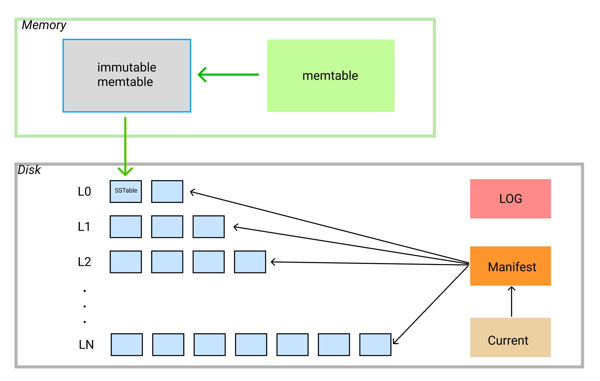
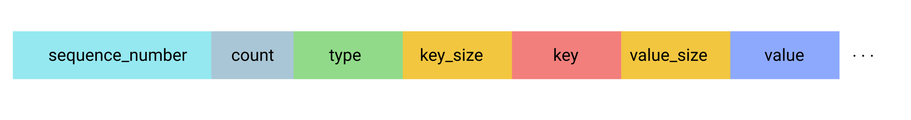
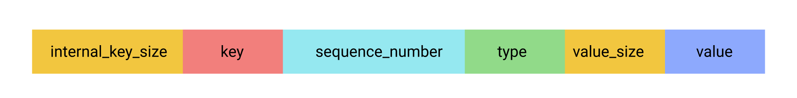
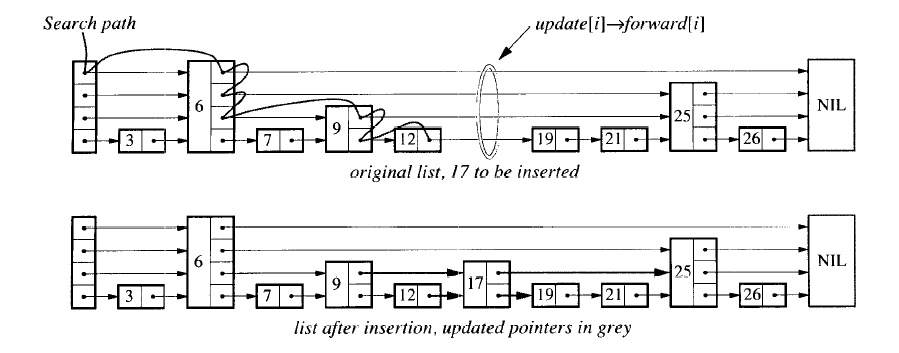
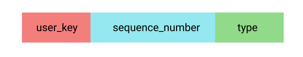
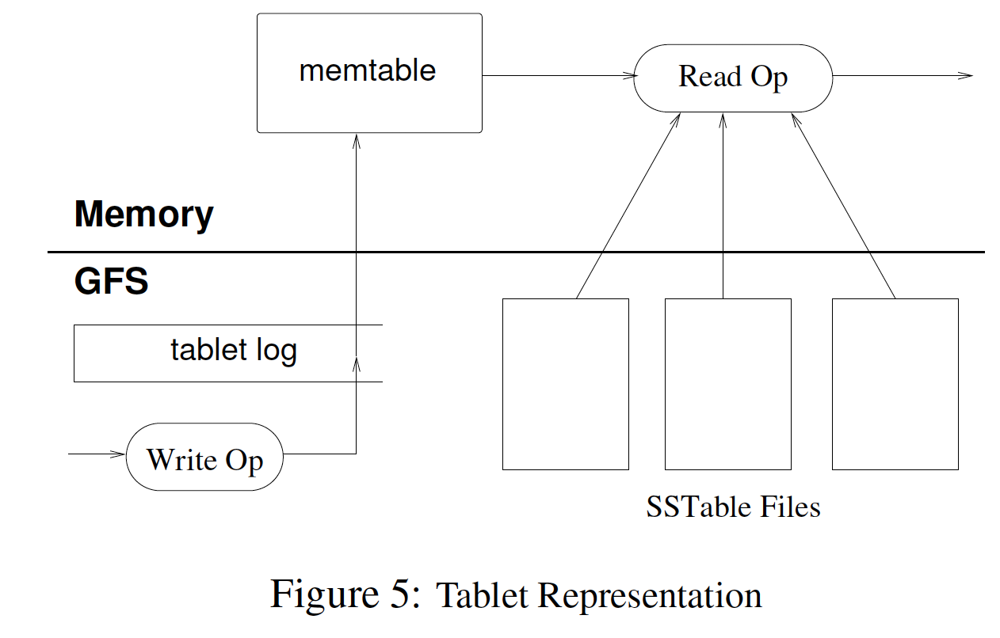

# 简介

LevelDB 是一个 key-value 持久化存储引擎，类似于单个 [Bigtable tablet (section 5.3)](http://research.google.com/archive/bigtable.html) 的实现。



LevelDB 提供了简洁的接口：`Put`，`Delete`， `Get`。


# 接口实现

## Put 

```c
Status DB::Put(const WriteOptions& opt, const Slice& key, const Slice& value) {
  WriteBatch batch;
  batch.Put(key, value);
  return Write(opt, &batch);
}
```

`Put` 接口内部将写入 key-value 封装成一个 `WriteBatch` 后，调用 `Write` 接口。

### WriteBatch

`WriteBatch` 将 key-value 存储到一个连续的 byte 数组里面，编码如下：



* sequence_number: 写入序列号，每次写入一个 key-value 后加 1 单调递增。
* count: 一个 `WriteBatch` 中写入 key-value 对的个数。
* type 是写入类型，有 2 种写入类型：
  * kTypeValue：写入 key-value 操作。
  * kTypeDeletion：删除 key 操作。其对应的 value_length 是0， value 是空。
* key_size: key 的大小，用`PutVarint32` 编码。
* key: 用户写入的 key 的值。
* value_size: value 的大小。
* value: 用户写入 value 的值。

可以使用 `WriteBatch`单次写入多个 key-value 来提升写入性能。

### Write

简单的写入流程如下：

1. 检查是否需要 compaction
2. 分配 sequence
3. 写 WAL 日志。
4. 如果 `WriteOptions` 中的 `sync` 是 true，则需要等待 WAL 日志 flush 完成。
5. 写入 memtable , 即 skip-list。

第 5 步写入前，需要将用户 key-value 和 sequence 一起编码成一个 byte数组后再写入 memtable，编码如下：



* Internal_key_size: internal key 的大小，它等于用户 key 的大小 + 8，其中 7 个字节存  `sequence_number`，一个字节存 `type`。

### memtable 的实现

memtable 内部实现是 [skip-list](https://homepage.cs.uiowa.edu/~ghosh/skip.pdf)。



插入 key 流程如下：

1. `FindGreaterOrEqual`, 找到一个大于等于 key 的节点，同时记录查找过程中各层索引信息。
   * 由于每个写入的 key 的 sequence 肯定不一样，所以肯定不会找到相等的 key。
2. 新建 node 并随机分配一个索引层高。
3. 插入 node 并更新各层的索引信息。


#### KeyComparator


用户写入的数据在 memtable 和 SSTable 中都是按照 key 大小有序排列的。底层存储的是 internalKey，其编码如下：



具体排序规则是：

* 默认按照user_key 的 []byte 比较，从小到大排序。
  * 用户也可以在初始化数据库时，传入自定义的 comparator 。
* 当 user_key 一样时，按 sequence_number 从大到小排序。即对于相同 user_key 的多次操作，最新的操作总是排在前面。


#### 并发

skip-list 不支持并发写入，但是支持 1 个写入的同时多个并发读。skip-list 中 node 的各层索引的更新和读取是采用的原子操作，使用 `release-acquire` 的内存顺序。


### Compaction 介绍

BigTable 论文的 5.4 节中介绍有3种 compact, 下面逐个介绍。

LevelDB 中的 SSTable 文件组织分成多层，但是 BigTable 论文中 Tablet 的架构并没有明确指出 SSTable 文件有多层，所以 LevelDB 的 compation 实现和论文里面描述我觉得有一些出入，也可能论文里面没有细说。




#### minor compaction

当 memtable 的大小超过  `write_buffer_size` 限制后，会将写满了的 memtable 转换成 immutable memtable，并新建一个 memtable 和 WAL 文件。然后其、后台启动一个线程将 immutable memtable 转换成 SSTable 文件。

minor compaction 有 2 个作用：

1. 控制（减少）内存的使用量。
2. 减少重启时从 WAL 日志中恢复的时间。

#### merging compaction

将一些 SSTable 和 memtable 作为输入进行 merge compaction 后输出到一个 SSTable 文件。

#### major compaction

将所有的 SSTable 作为输入进行 merging compaction 后输出到一个 SSTable 文件叫做 major compaction。

Major compaction 输出的 SSTable 文件是不含被 delete 的数据的，这样可以回收资源。 

### Compaction 实现

#### minor compaction

`CompactMemTable` 函数将 immutable memtable 转换成 SSTable 文件。用 `MemTableIterator` 遍历一遍 skip list，写出到 SSTable 文件。写完后将  immutable memtable 的内存释放。

默认将 immutable memtable 转换成的 SSTable 文件存放在那一层呢？默认是放在第 0 层，如果和这一层以及下一层已有的SSTable 文件的 key 范围没有重叠，且和下下层的重叠的文件总大小不超过 10 * max_file_size （避免在单次 merge compaction 时输入文件过大），则可以直接将 SST 文件下沉；最多下沉到第 2 层。详见函数 `PickLevelForMemTableOutput`。

#### merging compaction

merging compaction 是将第 N 层的部分 SSTable 文件和 N+1 层的部分 SST 文件做 merge, 然后输出写入到 N+1 层的 SST 文件。

##### 第 N 层是哪一层？


##### 第 N 层的部分文件是哪一部分文件？


#### 总结

`CompactMemTable` 这一步并没有做去重，即如果重复更新同一个 key 1万次，最终从 immutable memtable 导出到 SSTable 中还是会有 1万条数据。所以用户在短时间内可以使用 snapshot 读到某个历史版本的数据。单个人


## Delete

`Delete` 实现几乎和 `put` 一样，只是写入类型是 `kTypeDeletion`，其 value_length 是 0， value 是空。

## Get


# 参考资料

[LevelDB 官方文档](https://github.com/google/leveldb/tree/master/doc)

[levelDB 实现解析]([https://yuerblog.cc/wp-content/uploads/leveldb%E5%AE%9E%E7%8E%B0%E8%A7%A3%E6%9E%90.pdf](https://yuerblog.cc/wp-content/uploads/leveldb实现解析.pdf))

 [skip-list](https://homepage.cs.uiowa.edu/~ghosh/skip.pdf)

[如何理解 C++11 的六种 memory order](https://www.zhihu.com/question/24301047)

