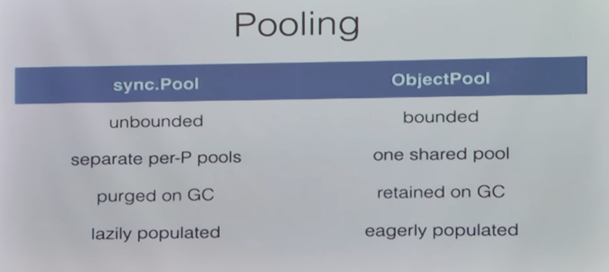

# 基础篇

## 工具

[VS Code 搭建 Go 开发IDE](https://www.wonsikin.me/2016/06/06/VS-Code-%E6%90%AD%E5%BB%BA-Go-%E5%BC%80%E5%8F%91IDE/)

[golang使用vendor目录来管理依赖包](http://www.jianshu.com/p/e52e3e1ad1c0)


* pprof 

  * https://stackimpact.com/blog/profiling-go-applications-in-production/

  ```Go
  //code
  import _ "net/http/pprof"
  http.ListenAndServe("localhost:6060", nil)

  #shell
  go tool pprof http://localhost:6060/debug/pprof/profile
  ```

* sync.Pool  ， 

  * https://www.jianshu.com/p/2bd41a8f2254	 简介
  * https://blog.cloudflare.com/recycling-memory-buffers-in-go/   垃圾回收，和 pool 简单实现和超时删除实现

    ​

  

* 避免 GC 过多的技巧，来自Uber工程师的一些避免过度 GC 的损耗，如果避免的技巧，如少用指针，缓冲池等

  https://www.youtube.com/watch?v=q1h2g84EX1M

* 连接池

  * http://io.upyun.com/2016/01/28/how-to-use-redis-pool-in-go/
  * https://yushuangqi.com/blog/2016/liao-liao-tcplian-jie-chi.html
  * https://blog.csdn.net/pangudashu/article/details/54291558      github.com/go-sql-driver/mysql 连接池分析

* 时间轮

  * http://www.10tiao.com/html/249/201703/2651959961/1.html
  * http://xiaorui.cc/2018/03/28/%E5%88%86%E6%9E%90golang%E5%AE%9A%E6%97%B6%E5%99%A8cpu%E4%BD%BF%E7%94%A8%E7%8E%87%E9%AB%98%E7%9A%84%E7%8E%B0%E8%B1%A1/

* string 和 []byte   ，由于`Go`语言中字符串是不可修改的，因此如果要修改其中内容，就要把其转化成`byte slice`。此外，`byte slice`也可以转化成字符串。这两种转化都需要分配一块新的内存，然后进行内容拷贝。

  * https://sheepbao.github.io/post/golang_byte_slice_and_string/


## 从源码安装Go

[Installing Go from source](https://golang.org/doc/install/source)

需要注意的是，在 ./all.bash`安装 之前，要设置`$GOROOT_BOOTSTRAP` 环境变量，设置为已有的GoHome，比如`/usr/local/go/`  。

## File

参考：[Working with Files in Go](http://www.devdungeon.com/content/working-files-go#write_bytes) , 中文版[Go文件操作大全](http://colobu.com/2016/10/12/go-file-operations/)

​	

## map

map的实现：https://guidao.github.io/go_map.html， https://tiancaiamao.gitbooks.io/go-internals/content/zh/02.3.html

参考（以下是摘录） [Go maps in action](https://blog.golang.org/go-maps-in-action)

### Exploiting zero values

* a map of boolean values can be used as a set-like data structure,This example traverses a linked list of `Nodes` and prints their values. It uses a map of `Node`pointers to detect cycles in the list.

  **Maybe a map of struct{} values can be better~**

```Go
    type Node struct {
        Next  *Node
        Value interface{}
    }
    var first *Node

visited := make(map[*Node]bool)				//	visited := make(map[*Node]struct{})
    for n := first; n != nil; n = n.Next {
        if visited[n] {						//	if _, ok := cmap[i]; ok {
            fmt.Println("cycle detected")	//	...
          break								//	...
        }									//	}
        visited[n] = true					//	visited[n] = struct{}{}	
        fmt.Println(n.Value)				//
    }
```

* Another instance of helpful zero values  is**a map of slices**. Appending to a nil slice just allocates a new slice, so it's a one-liner to append a value to a map of slices; **there's no need to check if the key exists.** In the following example, the slice people is populated with `Person` values. Each `Person` has a `Name` and a slice of Likes. The example creates a map to associate each like with a slice of people that like it.

```Go
    type Person struct {
        Name  string
        Likes []string
    }
    var people []*Person

    likes := make(map[string][]*Person)
    for _, p := range people {
        for _, l := range p.Likes {
            likes[l] = append(likes[l], p)
        }
    }

	//To print a list of people who like cheese:
	for _, p := range likes["cheese"] {
        fmt.Println(p.Name, "likes cheese.")
    }
	//To print the number of people who like bacon:
	fmt.Println(len(likes["bacon"]), "people like bacon.")
```

Note that since both range and len treat a nil slice as a zero-length slice, these last two examples will work even if nobody likes cheese or bacon

### key types

* map keys may be of any type that is**comparable**. The [language spec](http://golang.org/ref/spec#Comparison_operators) defines this precisely, but in short, comparable types are boolean, numeric, string, pointer, channel, and interface types, and structs or arrays that contain only those types. Notably absent from the list are slices, maps, and functions; these types cannot be compared using `==`, and may not be used as map keys.
* contrast：recommend 2

```go
/**  used to tally web page hits by country  **/

//	1:  this approach becomes unwieldy when adding data
hits := make(map[string]map[string]int)
n := hits["/doc/"]["au"]
func add(m map[string]map[string]int, path, country string) {
    mm, ok := m[path]
    if !ok {
        mm = make(map[string]int)
        m[path] = mm
    }
    mm[country]++
}
add(hits, "/doc/", "au")

//	2:	recommend
type Key struct {
    Path, Country string
}
hits := make(map[Key]int)
hits[Key{"/", "vn"}]++		//incrementing (and possibly creating) the appropriate counte
n := hits[Key{"/ref/spec", "ch"}]	//how many Swiss people have read the spec:

```

### **Concurrency**([sync.map](https://golang.org/pkg/sync/#Map))

https://github.com/orcaman/concurrent-map  

​	参考:[blog](http://colobu.com/2017/07/11/dive-into-sync-Map/) 


​	[Maps are not safe for concurrent use](http://golang.org/doc/faq#atomic_maps) , but **[sync.Map](https://golang.org/pkg/sync/#Map) is a concurrent map with amortized-constant-time loads, stores, and deletes. It is safe for multiple goroutines to call a Map's methods concurrently**.

### Iteration order

```go
import "sort"

var m map[int]string
var keys []int
for k := range m {
    keys = append(keys, k)
}
sort.Ints(keys)
for _, k := range keys {
    fmt.Println("Key:", k, "Value:", m[k])
}
```


## nil

[理解nil](http://www.jianshu.com/p/dd80f6be7969) 


## channel

[优雅的关闭channelp](http://www.jianshu.com/p/d24dfbb33781)

# 标准库篇

## ioutil

* ```
  func ReadFile(filename string) ([]byte, error)
  ```

## os

* ```
  Create(name string) (*File, error)	//新建一个文件名为name，权限为0666 的文件，**如果name文件已存在，则删除覆盖**
  ```

## sort

* ```go
  func Sort(data Interface)	//It makes one call to data.Len to determine n, and calls to data.Less and data.Swap. 所以可以对自定义的数据结构实现相关接口就能调用
  ```


## [unsafe](https://golang.org/pkg/unsafe/)

```
导入unsafe的软件包可能不可移植，并且不受Go 1兼容性指南的保护。
```

Go 1 兼容性指南这么说：

```
导入unsafe软件包可能取决于Go实现的内部属性。 我们保留对可能导致程序崩溃的实现进行更改的权利。
```


# 并发篇

* [Go by Example: Worker Pools](https://gobyexample.com/worker-pools) : 用channels 实现jobs 分发和 result 返回
* [调试利器：dump goroutine 的 stacktrace](http://colobu.com/2016/12/21/how-to-dump-goroutine-stack-traces/)
* go 运行速度提升编码：http://wetest.qq.com/lab/view/259.html，伪共享，无锁队列，内存管理
* [Go 性能调优，介绍调优方法，书籍，心得](https://stackimpact.com/docs/go-performance-tuning/)


工程经验：

* Golang工程经验(https://juejin.im/post/5a6873fb518825733e60a1ae)


# 深入解析

[GoRoutine 实现原理的视频，强推，讲的很好](https://www.youtube.com/watch?v=KBZlN0izeiY)

[go concurrency made easy](https://www.youtube.com/watch?v=yKQOunhhf4A)  推荐~

* goroutine调度

  * 基本的 G , P， M概念

  * 没有抢占式调度（对于没有函数调用，纯算法循环计算的G，scheduler依然无法抢占）

  * 网络IO轮询器（  netpoller  ），在基础的异步IO组件上，实现高效的网络IO。

  * go并发编程第四章

  * https://tonybai.com/2017/06/23/an-intro-about-goroutine-scheduler/

  * http://colobu.com/2017/05/04/go-scheduler/

    * go tool trace](https://making.pusher.com/go-tool-trace/index.html)

    ​

* [[Debugging performance issues in Go programs](https://software.intel.com/en-us/blogs/2014/05/10/debugging-performance-issues-in-go-programs)]  调试利器