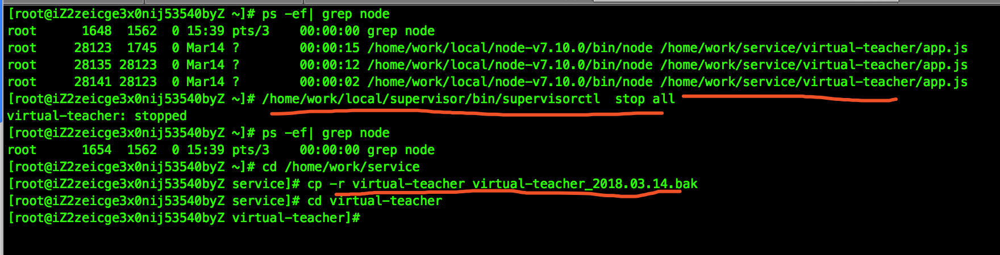

## 上线步骤

* 注意： 本次修改涉相关数据库的结构修改，请严格按照以下步骤修改
* 将虚拟老师 和 推流端的 文件夹做好备份

#### 虚拟老师端( 绿叶前辈陪同~ )

1. 停supervisor , 备份虚拟老师文件夹

   

2. 拉取  10.2.250.21/zby_api/virtual-teacher.git  ,  online-libu 分支，直接用代码库中的文件替代线上的文件，需要更新的问价列表如下：

   ```
   更新文件：
   app.js
   utils/dealResult.js 
   utils/downloadJson.js  
   utils/fileCRC64.js  
   utils/send_http_post.js  
   utils/winstonLogger.js

   新增文件
   change_date.js
   sqlite/*
   ```

3. 进入新增加的 sqlite 目录， 执行 

   ```shell
   cd sqlite
   npm install #可能比较慢，试试先装  cnpm然后 用  cnpm install
   node sqlite.js	//创建  sqlite 表
   ```

4. 执行以下命令修改 redis  键名。

   ```shell
   cd ..
   node change_date.js  #等待2分钟，然后 ctrl + c 退出
   ```

5. 修改配置文件, 可以直接用之前线上的配置文件， 修改和添加几个参数即可：

```Json
"order_warn_time_out": 1000*60*60*24,      //约课超时			这是修改，原来就有的，约课超时改为24小时
"transcoding_time_out": 1000*60*2,        //转码超时时间   这是新增，原来没有 
```

6. 启动supervisorctl 

   ```
   supervisorctl reload
   ```


###推流端上线

1. 备份项目里面的code文件夹， 里面有 一个  `task_list.db` ， 这个文件是数据库存放数据的文件，非常重要，一定要备份~

2. `supervisorctl stop all`

3. 进入code文件夹, 修改  sqlite 的表结构

   ```shell
   #/root/firstleaprecord/code
   sqlite3 task_list.db
   >alter table task_list add column institution_id VARCHAR(250);  #修改表结构
   >select class_id , institution_id from  task_list;						#验证表结构是否修改成功，不成功该语句会报错
   ```

4. 新增表

   ```Shell
   #/root/firstleaprecord/code
   python model.py
   ```

   ​

5. 从代码库中更新文件如下

   ```
   #/root/firstleaprecord/code
   commands.py
   idc_client_nsp.py 
   model.py
   util.py
   change_date.py  		#新增文件  
   db_helper.py      
   filemanager.py    
   livestreamer.py
   ```

6. 新增配置文件参数

   ```
   wget_path=/usr/bin/wget			#wget 命令路径，下载文件用，机器上没有则需要安装

   DOWNLOAD_RATE=1000k				#  下载速度限制，

   #max number of video
   MAX_VIDEO_NUM=1000						#缓存视频做大数量，可以适当调整

   #max size of all video ,   G
   MAX_VIDEO_SIZE=1000						#缓存视频磁盘最大容量，单位  G
   ```

   ​

7. 更新表数据，

   ```shell
   #/root/firstleaprecord
    . ./firstleap/bin/activate				#启动python 虚拟环境
    cd code
    python change_date.py			#change_date.py 是代码库里面新增的文件，以前没有
   ```

8. `supervisorctl reload  `


### 虚拟老师

1. 新增API接口（ POST ）：

   调用阿里云oss转码_API		

   调用ECS服务器转码_API

```Json
// POST
//还没具体确定参数
body={
    record_id:6666
    video_resolution: "720P"
  	sign:md5()
}
```

2. 新增 redis_publish 

```Json
//收到 redis 转码 publish
{
    cmd:"transcoding",			//转码
	  record_id: 6666,			//
	  video_resolution: "720P",	// "1080P" / "720P"   /   "480P"   /  240
	result:  "sucess",   		
	transcode_video_url: "http://...record/4940_22/video_4940_22.flv", 	//转码后的视频url
	type: "oss"					// "oss" / "ecs" 的转码结果
}
```

3. 约课时 redis publish新增字段

```json
{
    "record_id":6666,
	  "video_url_list": video_url_list,		//是一个obj
	  "video_resolution": "720P"
}

video_url_list={
    //"720P":"http://crazycs.com/720p.flv",
    "480P":"http://crazycs.com/480p.flv",
    "240P":"http://crazycs.com/240p.flv"
}
```

4. 视频转码状态存储——sqlite

```SQL
CREATE TABLE IF NOT EXISTS video_list (
    record_id INTEGER,			
    resolution varchar(10),
    status varchar(20)
)
```

5. 代码逻辑

```js
收到 redis 约课 publish：
	if video_resolution == undefined  	//兼容以前版本，不传清晰度参数说明是以前的课
		//正常约课

	else if video_resolution in video_url_list	//相应的清晰度已经在 video_url_list 里面，可以直接下载
		// 正常约课
	else
		if 根据 record_id 和 清晰度 查询数据库有无相应的记录			 		  	
			//检查对应清晰度的状态
			if 转码中 
				把 class_id 加入到  redis 的 record_resolution 的list中
			else if 转码成功
				报警，返回约课失败
				//应该不存在这种状态，如果转码成功，约课时 video_url_list 里面就应该包含此 清晰度的 url 了 
			else if 转码超时
            	返回约课失败
            else if 转码失败
            	// 重试转码
                跟新 record_id , resolution 的状态设置为 转码中
                调用阿里云oss转码_API
                把 class_id 加入到  redis 的 record_resolution 的list中
				
		else	//本地没有 record_id 记录
			新增 record_id , resolution 记录到本地 , 并把状态设置为 转码中
			调用阿里云oss转码_API
			把 class_id 加入到  redis 的 record_resolution 的list中
```

```Js
收到 redis 转码 publish

	if 根据 record_id 和 清晰度 查询数据库有无相应的记录
		if result =  sucess 	//转码成功	
			从 redis 的 record_resolution 的list中  取出class_id_list  ， 然后进入 正常约课  流程
			然后删除该记录，防止内存溢出	
		else	//转码失败
			if type == OSS 		//OSS失败
				调用ECS服务器转码_API
			else 				// ECS也失败
				从 redis 的 record_resolution 的list中   取出class_id_list  ， 然后进入 回调约课失败
	else:
		// 理论上不会有此情况
		报警 
```

6. 转码超时时间设置

7. 新增报警错误码

   ```
   "207":"视频转码服务超时未完成",
   "208":"视频转码失败",
   "316": "磁盘空间已满",
   "501": "异常报警，本地查询相关视频清晰度转码已成功，但约课时未发送包含改清晰度的视频url",
   ```

   ​


### 推流端

1. record_id 作为视频文件夹和文件名 

   record_id=6666

   ```shell
   /home/video/
   		   6666/
   				 6666.flv			#以前没有 分辨率 参数时的文件名
   				 6666_720P.flv
   				 6666_480P.flv
   ```

2. 文件管理，数据存储在 SQLite 中 ， 当磁盘空间或者视频数量超过  .env 文件的设置后，删除旧文件， 当无旧文件可以删时，新的约课报失败

   ```python
   #视频表，做文件管理用
   class Video_Table(Base):
       __tablename__ = 'video_list'

       id = Column(String(250), primary_key=True)     # record_id
       num_cite = Column(Integer, nullable=True)  # +1 when order , -1 when over class
       site = Column(String(250), nullable=True)  # 存放路径
       update_time = Column(Float, nullable=True) # 最新更新时间，方便LRU算法删除旧视频

   #/class_id ---> video  对应表
   class Class_Video(Base):
       __tablename__ = 'class_list'

       class_id = Column(String(250), primary_key=True)
       video_id = Column(String(250), nullable=False)
       site     = Column(String(250), nullable=True)  # video store file site
   #视频文件的磁盘容量以及数量，每次启动时会扫描磁盘，启动后不会扫描
   class DIR_INFO(Base):
       __tablename__ = 'dir_info'

       dir = Column(String(250), primary_key=True)
       size = Column(Float, nullable=False)
       num  = Column(Integer, nullable=False)
   ```

3. 下载限速

   ```shell
   wget -c --limit-rate=300k http://.......
   ```

4. 配置文件 .env 新增参数

   ```shell
   #wget 命令路径
   wget_path=/usr/bin/wget
   #下载限速
   DOWNLOAD_RATE=1000k

   #max number of video
   MAX_VIDEO_NUM=1000

   #max size of all video ,   G
   MAX_VIDEO_SIZE=10
   ```


### ECS转码

- 下载

  ```
  下载哪个清晰度的视频来转码 ？
  ```

- 转码

  ```shell
  ffmpeg -i 3005.flv -acodec copy -s 320x240 3005_240P.flv
  ```

- 上传

