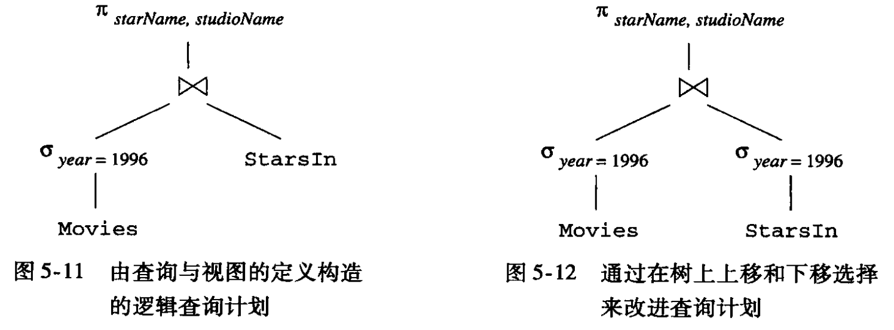

1. SQL 解析优化—语法分析树，主要是通过等价变换，把表达式树换成一个等价的表达式树。

   - **下推选择**，首先将 选择 尽可能的往上移，再把 选择 下推到所有可能得分支。

     

   - 下推投影

2. 从语法分析树到逻辑查询计划。 这部分看不太懂…...

   * 转换成关系代数
   * 从条件中去除子查询
   * 逻辑查询计划的改进，用 代数定律重写计划，依然是等价变换~
     * 连接顺序？
     * 如果选择条件是多个条件 AND  ， 可以把该条件分解并 分别将每个条件下推，类似于下推选择 ？

