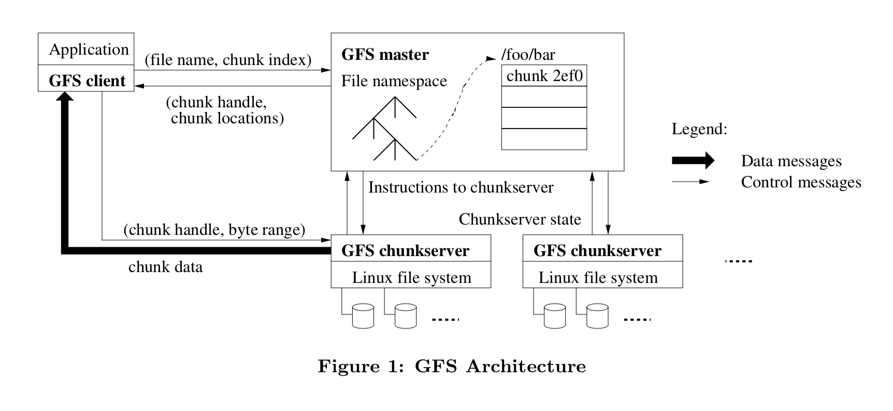
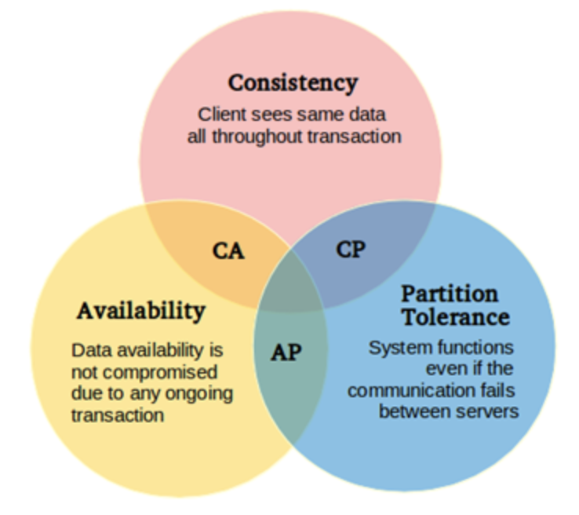
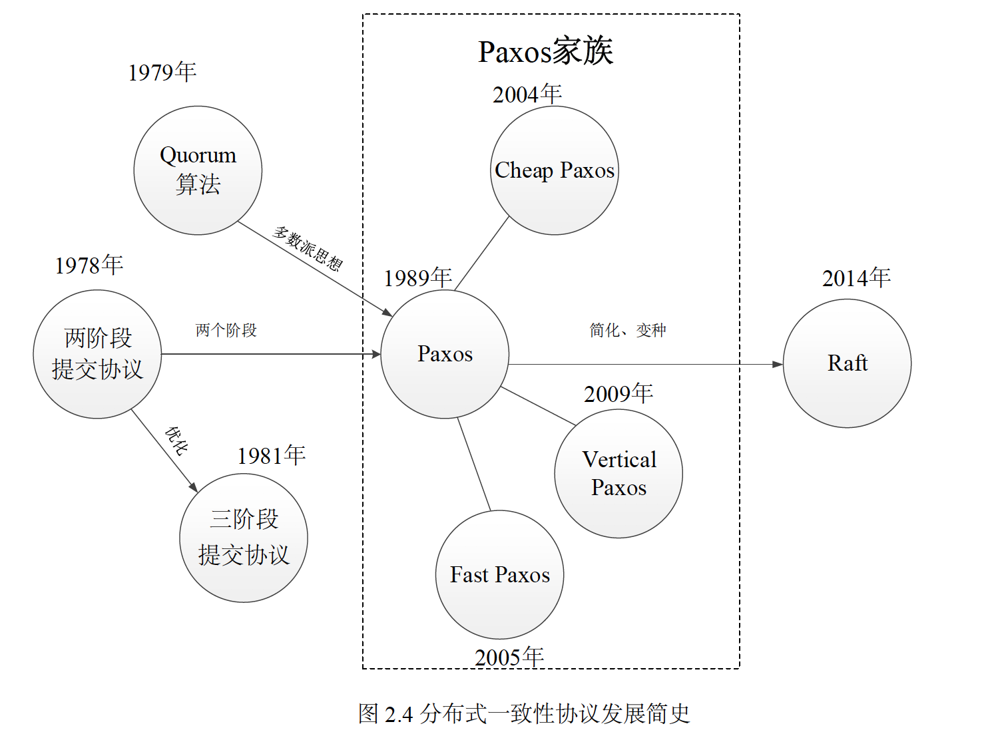
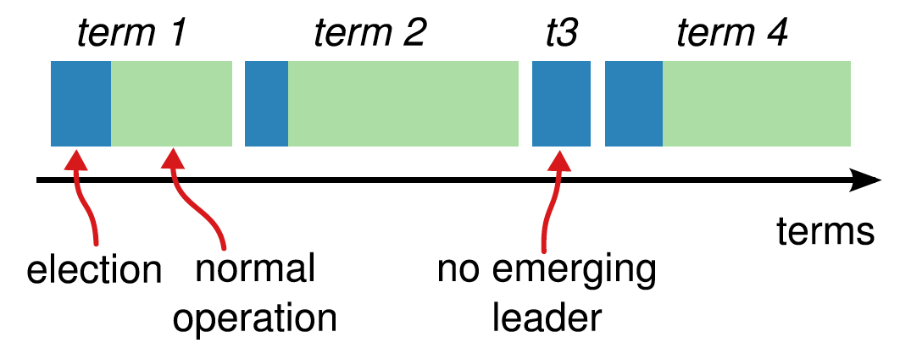
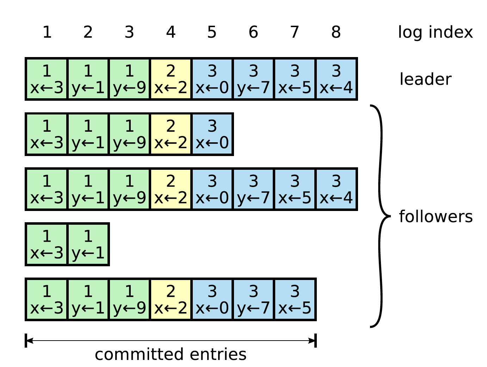
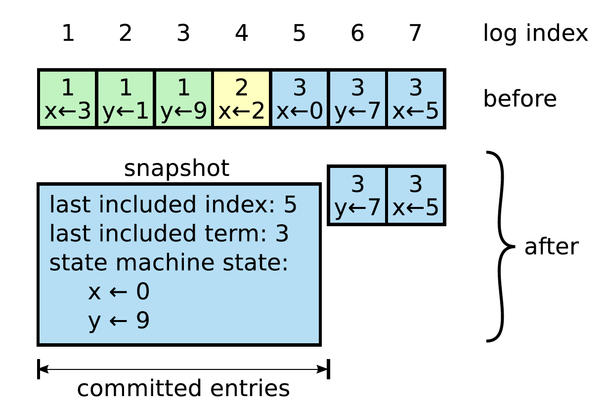
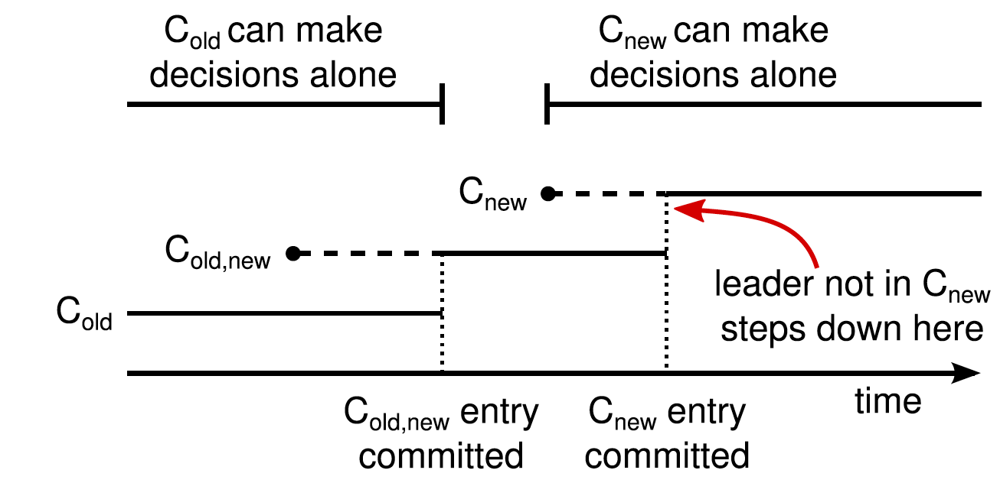

1. 绪论
   * 背景
     * 分布式存储
   * 目的和意义
   * 国内外现状
     * Bigtable ， Cassandra ， Dynamo数据库的特点分析，比较
   * 本文主要研究内容和结构安排

2. 系统需求与分析

   * 系统功能需求分析
     * 一致性需求分析
     * 事务支持需求分析
     * 持久化需求分析
     * 自动伸缩，扩容，负载均衡分析


   * 系统性能需求分析
   * 相关技术介绍
     * 一致性协议
     * 2PC 
     * 哈希算法
     * 观察者设计模式

3. 基于Raft 协议的 K/V存储设计与实现
   * 整体架构设计
     * 整体架构
     * 一致性算法选择
     * 持久化方案选择
     * 系统各个模块间通讯方式设计
   * 设计与实现
     * raft 一致性算法的实现
     * 持久化 实现
     * 观察者模式实现
     * 事务支持
     * 系统弹性伸缩

4. 测试

   * 系统模块单元测试
   * 系统性能测试
   * 测试结果分析


## 技术储备

### LaTeX学习

https://zhuanlan.zhihu.com/p/24101761

http://www.hanlindong.com/2017/latex-on-mac/

http://blog.csdn.net/simple_the_best/article/details/50608124

http://blog.csdn.net/simple_the_best/article/details/51244631

LATEXLATEX与Word的相互转换:Pandoc

模板： http://www.latexstudio.net/archives/category/latex-templates/thesis-template

### TiDB

[官方文档](https://pingcap.com/docs-cn/overview/#tidb-%e7%ae%80%e4%bb%8b)

http://chuansong.me/n/720316151966

[2018校招ppt](http://h5.ppj.io/PneaURFh/index.html?from=timeline&isappinstalled=0)

- 想深入理解业界最前沿的分布式数据库 Spanner 的设计和思考，如何从 0 到 1 落地实现
- 如何设计和实现世界前沿的分布式 SQL 优化器，让一个复杂的 SQL 查询变的无比轻快智能
- 如何在成千上万台集群规模的情况下，实现无阻塞的表结构变更操作，而不影响任何在线的业务
- 如何实现一个高效的分布式事务管理器，让 ACID 事务在大规模并发的分布式存场景下依然可以高效可靠
- 如何基于一致性的 Raft 协议实现快速稳定的数据复制和自动故障恢复，确保数据安全
- 如何在一个 PR 提交之后，快速验证千万级别的 tests 是否全部通过，性能有没有显著提升

### etcd

* [Etcd 架构与实现解析](http://jolestar.com/etcd-architecture/)
* [etcd：从应用场景到实现原理的全方位解读](http://www.infoq.com/cn/articles/etcd-interpretation-application-scenario-implement-principle)
* [基于Go的K/V数据库BoltDB简介](http://www.opscoder.info/boltdb_intro.html)  ,  [http://boltdb.cn/](http://boltdb.cn/)


### paper read

* Dynamo: amazon's highly available key-value store
* HyperDex: a distributed, searchable key-value store
* Bigtable: A Distributed Storage System for Structured Data
* Cassandra - A Decentralized Structured Storage System
* Spanner: Google’s Globally-Distributed Database  ， [厦门大学计算机系中文翻译](http://dblab.xmu.edu.cn/post/google-spanner/)
  * https://segmentfault.com/a/1190000009707788  CAP
* ​


#### GFS(2003)

* 适合存储大文件， chunk 的大小是 64 MB（内存碎片）。
* Master 节点管理所有的文件系统元信息（namespace , 访问控制信息，文件和chunk的映射，chunk的位置信息）, chunk 的位置信息在 master启动时轮询 chunkserver (启动后怎么知道 chunkserver 的IP), 不用持久化。
* ​




* 每个chunk 在创建时，分配一个不变的，全局唯一的 64 位 chunk 标识
* Master 和 chunksever 有周期性的 心跳检测
* client 可以缓存数据元信息（版本号？）。Chunkserver 不需要缓存文件数据 ， 因为 文件 以本地方式保存， Linux 会把经常访问的数据缓存在内存中。
* 日志 + checkpoint + COW
* Master 为 chunk的一个副本建立 lease 作为主chunk , 初始为60秒
* 空间回收采用惰性策略
* 每个Chunk服务器都使用Checksum来检查保存的数据是否损坏。


#### BigTable


摘要

​	随着大数据和深度学习的飞速发展，需要存储和处理的数据量日益增多，传统的的单机数据库的性能和容量已经难以满足现代的数据规模和效率要求。将传统的单机数据库转变为分布式数据库成为一种有效的解决方法。面对超大规模，海量数据，高可用性，高扩展性的需求下，构建高性能，高可用性的大规模分布式存储系统受到了工业界和学术界的广泛关注。

​	本文主要研究一种基于Raft一致性算法，来实现分布式的 key-value 存储。主要工作包括以下几个部分：

​	第一部分是分析已有的SQL和NoSQL数据库的特点和不足，设计并实现分布式，高性能的数据库。通过分析多种一致性算法的原理，比较各种算法的特点，选取Raft算法作为分布式数据库的中数据一致性的算法。

​	第二部分，分别从 Leader 选举， log 复制 ，数据读写等方面解析Raft 算法的实现细节，并优化Raft协议的读性能。 单机K/V 存储，数据持久化等等，mvcc多版本控制（是否要做）？

​	第三部分，设计和实现 raft协议， k/v存储，数据持久化，gRPC等的分布式数据库，并测试。最后，根据测试结果进一步优化设计和实现，研究进一步提高性能和可靠性的设计和方法。

​	本文所研究的 分布式K/V存储数据库是 目前大规模存储的主要技术之一，论文的研究成果可以在一定程度上提高分布式数据库的性能和发展，是分布式数据库领域的一次有益的探索。

**关键词**：分布式数据库， Raft , key-value 存储 

传统数据库有关系型数据库和非关系型数据库。关系型数据库有：MySQL，PostgreSQL ， Oracle 等；非关系型数据库有：BigTable、HBase、Cassandra、CouchDB、MongoDB和Redis等。NewSQL：Google的Spanner，Amazon的Aurora等等

# 绪论

## 研究背景、目的和意义

随着云时代的到来，大数据和深度学习的急速发展，数据的类别和规模呈现空前的增长速度。传统的集中式数据库，数据存储在单点的存储服务中，单点的存储服务面对大规模的数据时成为系统的瓶颈，同时单点存储服务的可靠性和可用性也无法满足现代应用的需求。使得传统的单机存储系统难以满足如今海量数据增长的存储需求。

如何管理，存储 好如此庞大的数据也成了学术界和工业界研究的热点问题，关键挑战是设计一个高性能，高可用，高扩展的存储系统。分布式系统早在上世纪七八十年代就已经出现，只是在互联网的快速发展和大数据时代的到来，分布式系统才益发重要。同时，随着大数据，深度学习的到来，分布式处理的方式越来越受到业界的青睐。它通过将大量、便宜、不 可靠的存储设备联网在一起来提供具有高可靠性和高可用性的存储服务，很好地解决 传统 存储区域网络中 难以根除的容量和性能均衡分布的难题。这其中尤为瞩目的是分布式的 NoSQL 数据库，诸如 Google 的 BigTable[1]和 Spanner[2]，亚马逊的 Dynamo[3]，Facebook 的 Cassandra，HBase，ProjectVoldemort 等等。这些分布式非关系型数据库充分结合分 布式系统抗单点故障能力和 NoSQL[4]的天然水平伸缩性特点，能够从容应对海量数据。


## 国内外研究现状

Google 早在2006年发表了分布式数据库 BitTable 论文，详细介绍了Bitable 的实际应用和设计原理。Bigtable 设计之初是在千万台普通计算机上可靠的存储海量级别的数据。BigTable 已经实现了可扩展，高性能和高可用性。但是，BitTable 只支持单行事务，对于跨行，跨表的操作，无法提供强一致性的保证。为了解决这个问题，Google在2012 年又发表了 Spanner 论文。Spanner 是全球分布式数据库，通过同步复制和多版本并发控制来支持外部一致性的分布式事务。2013年，Google发布的 F1 在以Spanner 做为数据存储的基础上，支持分布式SQL查询和原子操作，跨数据中心同步和强一致性。Amazon 在2007年发布了分布式K/V数据库 Dynamo，支持高可用和高扩展，采用最终一致性来保证数据的高可用，属于AP。Cassandra 是由Facebook 在2008年开源的分布式键值存储管理系统。另外还有redis cluster ，Hbase等等。

在国内，阿里巴巴在2010 年研发了OceanBase 分布式数据库，支持海量数据存储的高性能分布式数据库，实现了跨行跨表的事务处理。TIDB是PingCAP公司近3年来研发的，其灵感来自于 Google 的 [F1](http://research.google.com/pubs/pub41344.html) 和 Google spanner, 支持包括传统 RDBMS 和 NoSQL 的特性。支持一致性的分布式事务并兼容MySQL协议。


## 本文主要研究内容及结构安排


# 第二章

http://www.infoq.com/cn/articles/cap-twelve-years-later-how-the-rules-have-changed

https://ying-zhang.github.io/cloud/2017/spanner-truetime-cap/

https://zhuanlan.zhihu.com/p/27544985

##CAP理论

CAP理论最早在1998年秋季提出，1999年正式发表。“三选二”的观点在几个方面起了误导作用。首先，由于分区很少发生，那么在系统不存在分区的情况下没什么理由牺牲C或A。其次，C与A之间的取舍可以在同一系统内以非常细小的粒度反复发生，而每一次的决策可能因为具体的操作，乃至因为牵涉到特定的数据或用户而有所不同。最后，这三种性质都可以在程度上衡量，并不是非黑即白的有或无。可用性显然是在0%到100%之间连续变化的，一致性分很多级别，连分区也可以细分为不同含义，如系统内的不同部分对于是否存在分区可以有不一样的认知。



## 数据一致性

在分布式数据库中，通过数据副本来保证高可用。如何保证数据和副本之间的数据一致性问题由此而生。数据一致性与系统的可用性等其他性能是相互冲突的，系统需要权衡不同的数据一致性来满足性能需求。因此，衍生出了两种数据一致性模型，用来表示不同程度不同特点的数据一致性。

#### 强一致性和弱一致性

强一致性可以理解为在任意时刻，所有节点中的数据是一样的。同一时间点，在节点A中获取到key1的值与在节点B中获取到key1的值应该都是一样的。

弱一致性包含很多种不同的实现，目前分布式系统中广泛实现的是最终一致性。
所谓最终一致性，就是不保证在任意时刻任意节点上的同一份数据都是相同的，但是随着时间的迁移，不同节点上的同一份数据总是在向趋同的方向变化。也可以简单的理解为在一段时间后，节点间的数据会最终达到一致状态。

## 数据一致性算法




### 2PC

###paxos

### Raft

因为Paxos 算法难以理解，而且算法结构自身需要大幅修改后才能应用到实际系统中，导致了实际上各个Paxos 的实现最终相差甚远。Diego Ongaro 和 John Ousterhout 在 2014年发表了Raft 一致性协议的论文，它比Paxos 容易理解，也容易实现，作者在博士论文里面把实现细节论述的非常清楚了。

Raft 协议是基于Log的复制状态机为核心。分布式集群 Raft Group 中，每个节点的状态只会有三种： Leader , Follower , Candidate 。正常情况下，一个 Raft Group组里面只有一个节点是Leader , 其他的节点都是 Follower 。节点与节点间通过RPC消息通信。一共有2种RPC：

* AppendEntries RPC : 由Leader 发起，用于和其他节点同步状态。

  ```
  //请求参数
  term ：Leader 的 CurrentTerm
  leaderId ：Leader 的 ID
  prevLogIndex ：上一条日志Entry 的 Index
  prevLogTerm ： 上一条日志Entry 的 Term
  entries[] ：需要同步的新的 Log Entries (为空就表示是心跳检测)，可能一次会发送多条日志，为了提升效率
  leaderCommit ：Leader 已提交的最大Index

  //结果参数
  term ：返回节点的currentTerm ,便于 Leader 更新自己的  currentTerm 
  success ： 如果 prevLogIndex 和 prevLogTerm 符合 Follower 或 Candidate ，则为  true , 表示成功
  ```

  ​

* RequestVote RPC      : 由 Candidate 发起，用于请求其他节点给自己投票，投票赞同数超过Raft Group 的一半数量后，则成功竞争成为Leader.

  ```
  //请求参数
  term ：发起该请求的Candidate 的 currentTerm
  candidateId candidate 的 ID
  lastLogIndex candidate 最新的一条Log entry 的 Index
  lastLogTerm candidate 最新的一条Log entry 的 term
  //结果参数
  term ：返回节点的currentTerm， 便于Candidate 更新自己的  currentTerm 
  voteGranted：true 表示获得投票
  ```

  ​

Follower 不会主动发起RPC请求，只会响应 Leader  和 Candidate 的RPC请求。

 

[server 状态转换图 ]

每个节点保存的的相关信息有：

* currentTerm : 该节点已知的最新的 Term ，初始值为0 。
* voteFor ： 在 currentTerm 下，该节点的选举Leader票投给了哪个节点。没投过票就是 null 。
* log[]  ：log entries 。每个 log entry 都是来自于 Leader 的 AppendEntries RPC。
* commitIndex ：已知的最大的 Committed index。
* lastApplied ： 已知加入到到 状态机 entris 的最大 index。

#### Leader 选举

Raft 使用心跳机制触发 Leader 选举。每个节点启动时，初始状态都是 Follower 。节点只要一直收到来自 Leader和Candidate 有效的RPC，一直保持Follower状态。Leader会周期性的发送心跳RPC（其实是不带Entries信息的AppendEntries RPC）给其他节点。

当某一个节点的超时未收到来自Leader 或者 Candidate的有效RPC后，该节点认为 Raft Group 中没有Leader ，然后将自己的 currentTerm 加1，把自己的状态转换成  Candidate ， 然后发起 投票请求（RequestVote RPC ）。



[Raft 协议中 Leader 节点选举的时间图] 

当一个 Candidate 获得大多数节点的投票后， 该Candidate 就能成功当选 Leader 。

 每个节点的投票规则是 "先到先得"，即在一个新的  term 里，该节点还没投过票，先收到的投票请求会获得投票，同一 Term 后面收到的投票请求就会拒绝。具体还有其他的投票条件：

* RequestVote RPC附带的 term 必须大于或等于 当前节点的 currentTerm
* RequestVote RPC附带的 lastLogIndex 和 lastLogTerm 至少和自己的一样，或者更新。

Candidate 成功当选 Leader后，需要周期（该周期时间必须小于最小超时时间，并根据网络延时情况调整）发送心跳检测给其他节点，其他节点收到心跳RPC后，会将自己的计时器清0 ， 重新开始超时计时。 这有以下作用：

* 确定自己的Leader地位
* 防止其他节点超时后发起新的选举。
* 可以检测其他节点是否还存在（可能机器宕机或者网络分区）。

可能会出现选举失败，如果出现选举失败后，会等待超时后重新发起选举流程。为了防止多个节点同时超时发起选举而导致都没有获得大部分同意投票，每个节点的超时时间是不同的，随机的，在最小超时时间和最大超时时间之间。这样只要随机时间生成函数选择合适，可以避免绝大部分的同时选举冲突。

#### 同步日志

当一个Leader被成功选出来后，就能接收客户端的请求了。每个客户端的请求包括一条 命令需要被复制状态机来执行。Leader把命令封装成 一条 新Entry后添加到自己的 Log Entries 中， 然后发起 AppendEntries RPC 把新Entriy 发送到其他节点。当新Entry  被成功复制到大多数节中后，Leader 将新Entry 添加到自己的状态机里面，并返回执行结果给客户端。如果 Follower 宕机或者执行很慢或者网络分区，AppendEntries RPC会一直发送直到所有的 Follower 的 Log Entris 和 Leader  保持同步。

只有当一条日志被提交后， Leader 才能将它 添加到自己的状态机中。Raft 保证一条已提交的日志已经保存到大多数的Raft Group 中的节点中。



[每个节点的 Log 组成]

当Leader选举成功后，日志就以Leader节点上的日志为准。

Leader会为Raft Group 中的每个节点维护一个nextIndex 变量，表示Leader应该发送的下条日志的 index , 初始化为Leader的最后一条日志的下一个Index 。 Leader 给Raftgroup 中的Follower 发送AppendEntries RPC 消息，它将带两个参数，分别是TermId 和nextIndex - 1，TermId 也就是nextIndex-1 这个槽位的日志条目的TermId，Follower 接收到AppendEntriesRPC 后，会从自己的日志中寻找是否存在这样的日志条目，如果不存在，就给Leader 回复拒绝消息，然后Leader 则将nextIndex 的值减1，重复上述操作，直到AppendEntriesRPC 消息被接收。也可以在AppendEntries RPC 返回时Follower返回自己最新的一条日志的Index加1，这样在Leader和 Follower之间的log差距很大时，可以很好的提升效率。

#### 快照

为了防止日志无限制的增长，否则系统重启时需要很长的时间来进行回访日志。所以需要对日志做快照进行处理。其原理和主流数据库（如 MySQL ， PostgreSQL等）对日志文件做checkpoint 是一样的。



[快照原理图]

在Raft Group 中， 每个节点独立对自己的日志进行快照，并且只能对已经添加到状态机的日志进行快照。快照包括一些元数据，包括快照包含的最后一条已提交的日志条目的index 和 Term。 一旦完成改快照后，就可以把快照之前的日志删除。

关于什么时候做快照，有一定得权衡，做的太频繁，会消耗大量的磁盘IO， 太久不做，一旦节点重启需要回放的日志很多，影响可用性。


#### Leadership transfer extension（Leader 转移）

Leader 转移的需求对实际使用很重要，这点在Raft 的 博士论文中有提到过，便于使用中的负载均衡或者移除节点。

在Raft中转移Leader ， 当前Leader把自己所有的日志同步到要转移的目标节点上，确保所有提交的日志同步完成后，目标节点不等待超时就转变为Candidate并发起一个 RequestVote RPC，在一般情况下，大多数节点都会同意投票，下面是具体细节：

* 当前Leader 停止 接受客户端的请求
* 当前Leader把所有已提交的日志同步到目标服务器中
* 当前Leader 发送一个 TimeoutNow 请求给目标节点，效果和目标节点超时一样，然后目标节点把自己的 CurrentTerm 加1，转为Candidate ， 并发起一个新的Leader 选举。

一般情况下目标节点会成功当选新 Leader， 此时 Leader 转移完成。也有可能目标服务器未能成功当选新Leader，然后当选举超时后， 当前Leader（发起Leader 转移的Leader）会中断 Leader 转移，并恢复接收客户端的请求。最糟糕的情况下，发起Leader 转移的Leader 和 目标节点都失败了，此时Raft Group 中没有Leader , 这将也会因为超时发起新的Leader选举完成后选出Leader 并继续接收客户端的请求。


#### 集群成员变更

成员动态变更在实际上也是非常有用的一个功能。为了保证集群成员变更的绝对安全，在成员变更的过程中需要防止可能会出现在同一Term中出现2个Leader。但是，不可能原子将所有节点同时切换到新的配置，一定会在切换过程中整个集群分裂成2个不同的分区，一个分区是老配置，另一个分区是新分区。

为保证成员变更过程中的安全，必须使用两阶段的方法。Raft 论文提出的 joint consensus算法，只要 joint consensus 被提交，系统就已经切换到新的配置了。



[配置更新时间轴]

图中虚线表示配置 Entry 已经被创建但还没提交，实线表示配置Entry最新的提交。Leader 首先创建 C-old-new 配置entry , 然后提交。然后创建C-new Entry ， 然后提交。整个过程中不会出现 C-old 和 C-new 能够同时独立做决定。

当一个 Leader 收到成员变更的请求的时候，他首先会将 C-old 和 C-new 都放在 joint consensus 里面，作为一个 Raft Log 发送给其他的 Followers。当节点收到 Log，不需要等待 Log 被 committed，就可以使用最新的 C-new 配置了，但这时候，仍然只有 C-old 里面的集群能进行 Vote。如果这时候 Leader 当掉了，新选出来的节点 要不在 C-old 里面，要不在 C-old-new 里面，因为我们前面没约定 C-old-new 这个 Log 必须 committed。但无论是哪一种 Leader，C-new 这边的集群都不可能单边决策的。

当 C-old-new 被 committed 之后，就进行了 joint consensus 状态，在这个状态里面：

1. Log 会被复制到所有在两个 configurations 里面的节点上面
2. 在两个 configuration 里面的节点都可能被选为 Leader
3. 但只有 C-old 里面 majority 和 C-new 里面 majority 都同意，才能选出 Leader 和进行 Log 提交。

当进入 joint consensus 之后，Leader 就可以再次提交一个新的 C-new Raft Log，仍然是只要其他节点收到了这个 Log，就可以使用新的 Configuration 了，当 C-new 这个 Log 被 committed 了，那么 C-old 就没用了，不在 C-new 的节点就可以直接关闭。这套流程就能保证在任意时候，C-old 和 C-new 不会出现单边投票的情况。


#### Raft算法优化[https://github.com/pingcap/tikv]

先简单看下Raft 的处理流程：

1. Leader 收到 client 发送的 request。
2. Leader 将 request append 到自己的 log。
3. Leader 将对应的 log entry 发送给其他的 follower。
4. Leader 等待 follower 的结果，如果大多数节点提交了这个 log，则 apply。
5. Leader 将结果返回给 client。
6. Leader 继续处理下一次 request。

可以发现上述流程是典型地顺序执行操作，如果完全按照这个流程来实现，会有很多时间消耗在IO上，性能将会很糟糕。

##### Pipeline 和 Batch

操作系统和其他工程大部分场景经常用到的优化操作也是 Pipeline 和 Batch 。Leader 可以打包多次请求，然后一次发送给Follower，当然，需要限制单次发送的最大数据量。

如果只用 Batch 打包优化，Leader 还是必须等待Follower请求执行返回后才能继续处理下一个客户端的请求。Pipeline 可以用来加速处理流程。Leader 维护了一个NextIndex 变量代表要发送给Follower的下一条Entry  的 index。 一般来讲，只要Leader 和 Follower 之间建立连接后， 可以认为这个连接是稳定连接的。因此，当Leader  打包发送了一些 Entries 给Follower后， 可以直接跟新NextIndex 然后立刻发送下一条请求 Entry 而不用等待Follower之前的执行返回， 如果网络中断，或者Follower返回了一些错误，Leader需要重新调整NextIndex 然后重新发送 Entries。

#####并发Append日志

对于流程中的第二步和第三步，可以用并行执行来优化。也就是说，Leader 把请求Append到日志中和发送到Follower可以并行执行，因为只要大多数节点成功Append该日志后，该请求就认为是成功的，所以，即便是Leader Append Entry失败了并且在发送给Follower 的过程中发生异常，只要大多数节点成功Append了该条日志Entry，这条日志 Entry 依然可以被认为是成功提交的。

因为Append 日志Entry有写磁盘开销，所以完全可以在Leader写磁盘时让Follower尽快收到日志Entry并Append。

需要注意的是，Leader可能会先发送日志Entry给Follower , 然后Leader Append日志条目到日志里面去，Follower不能在Append日志Entry前就返回成功，如果Follower提前告诉Leader已经成功提交，但实际上后面Append的时候失败了，Leader依然会认为日志已经成功提交了。这种情况下，系统可能会出现丢失数据的情况。

#####异步Apply日志到状态机

当一个 日志 Entry 被大部分节点Append后， 就可以认为这个 日志 Entry 被 提交了，被提交的 日志 Entry 什么时候被 Apply 都不再影响数据的一致性， 所以当一个 Log被 提交后，可以用另一个线程异步Apply 这个日志Entry。

所以整个Raft 流程就可以变成：

1. Leader 接受一个 client 发送的 request。
2. Leader 将对应的 log 发送给其他 follower 并本地 append。
3. Leader 继续接受其他 client 的 requests，持续进行步骤 2。
4. Leader 发现 log 已经被 committed，在另一个线程 apply。
5. Leader 异步 apply log 之后，返回结果给对应的 client。

使用 asychronous apply 的好处在于我们现在可以完全的并行处理 append log 和 apply log，虽然对于一个 client 来说，它的一次 request 仍然要走完完整的 Raft 流程，但对于多个 clients 来说，整体的并发和吞吐量是上去了。


##### linearizable read-only queries

Linearizable Read通俗来讲，就是读请求需要读到最新的已经commit的数据，不会读到老数据。

为了防止Stale read 和脏读（没有Commit 的数据），读写请求都可以通过走一次raft协议来满足。然后，现实系统中，读请求通常会占很大比重，如果每次读请求都要走一次raft落盘，性能可想而知。所以优化读性能至关重要。

leader需要首先check自己是否在当前term commit过entry，这也是raft小论文中 5.4节 Safety中明确提到的，需要注意的事，这一步既为了防止stale read，也为了防止脏读。

从raft协议可知，leader拥有最新的状态，如果读请求都走leader，那么leader可以直接返回结果给客户端。然而，在出现网络分区和时钟快慢相差比较大的情况下，这有可能会返回老的数据，即stale read，这违反了Linearizable Read。例如，leader和其他followers之间出现网络分区，其他followers已经选出了新的leader，并且新的leader已经commit了一堆数据，然而由于不同机器的时钟走的快慢不一，原来的leader可能并没有发觉自己的lease过期，仍然认为自己还是合法的leader直接给客户端返回结果，从而导致了stale read。

Raft论文中提出了两种方法：

ReadIndex read ， 当 leader 要处理一个读请求的时候：

1. 将当前自己的 commit index 记录到一个 local 变量 ReadIndex 里面。
2. 向其他节点发起一次 heartbeat，如果大多数节点返回了对应的 heartbeat response，那么 leader 就能够确定现在自己仍然是 leader。
3. Leader 等待自己的状态机执行，直到 apply index 超过了 ReadIndex，这样就能够安全的提供 linearizable read 了。
4. Leader 执行 read 请求，将结果返回给 client。

不同于最开始的通过 Raft log 的 read，ReadIndex read 使用了 heartbeat 的方式来让 leader 确认自己是 leader，省去了 Raft log 那一套流程。虽然仍然会有网络开销，但 heartbeat 本来就很小，所以性能还是非常好的。

但需要注意，实现 ReadIndex 的时候有一个 corner case，在 etcd 和 TiKV 最初实现的时候，我们都没有注意到。也就是 leader 刚通过选举成为 leader 的时候，这时候的 commit index 并不能够保证是当前整个系统最新的 commit index，所以 Raft 要求当 leader 选举成功之后，首先提交一个 no-op 的 entry，保证 leader 的 commit index 成为最新的。

使用 ReadIndex，我们也可以非常方便的提供 follower read 的功能，follower 收到 read 请求之后，直接给 leader 发送一个获取 ReadIndex 的命令，leader 仍然走一遍之前的流程，然后将 ReadIndex 返回给 follower，follower 等到当前的状态机的 apply index 超过 ReadIndex 之后，就可以 read 然后将结果返回给 client 了。

第二种方法是 Lease Read，虽然 ReadIndex 比原来的 Raft log read 快了很多，但毕竟还是有 Heartbeat 的开销，所以可以考虑做更进一步的优化。

在 Raft 论文里面，提到了一种通过 clock + heartbeat 的 lease read 优化方法。也就是 leader 发送 heartbeat 的时候，会首先记录一个时间点 start，当系统大部分节点都回复了 heartbeat response，那么我们就可以认为 leader 的 lease 有效期可以到 start + election timeout / clock drift bound 这个时间点。

为什么能够这么认为呢？主要是在于 Raft 的选举机制，因为 follower 会在至少 election timeout 的时间之后，才会重新发生选举，所以下一个 leader 选出来的时间一定可以保证大于 start + election timeout / clock drift bound。

虽然采用 lease 的做法很高效，但仍然会面临风险问题，也就是我们有了一个预设的前提，各个服务器的 CPU clock 的时间是准的，即使有误差，也会在一个非常小的 bound 范围里面，如果各个服务器之间 clock 走的频率不一样，有些太快，有些太慢，这套 lease 机制就可能出问题。

# 系统需求与分析

## 事务

事务是数据库操作的基本单位，具有原子性，一致性 , 隔离性 和 持久性 这四个基本属性。

SQL定义的4种隔离级别，以下隔离级别依次从低到高：

* Read Uncommitted ：读取未提交的数据，即其他事务已经修改，但还未提交的数据。这是最低的隔离级别。
* Read Committed ： 读取已经提交数据。但是，在一个事务中，可能出现前后两次读取的结果不一样。如第一次读取时另一个事务还未提交，第二次读取时已经提交了。
* Repeatable Read : 可重复读，在一个事务中，对同一项，确保前后两次读取结果是一致的。
* Serializable : 可序列化，即数据库的事务是可串行化执行的，一个事务执行时没有别的事务在执行。是最高的隔离级别。

由于隔离级别的降低可能会引发的问题：

* Dirty Read : 一个事务读取了另外一个事务更新却没有提交的数据。
* 不可重复读
* Phantom Read ：

## 并发控制


### 2PL

### MVCC

