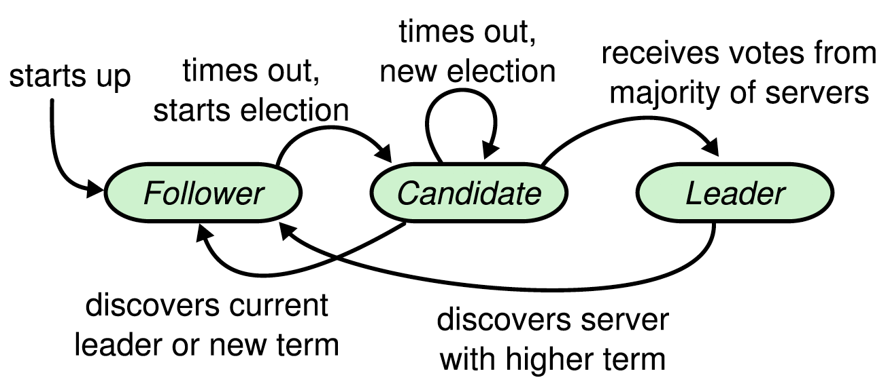
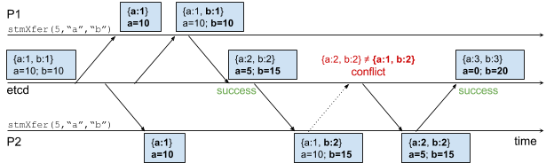

1. 绪论
   * 背景
     * 分布式存储
   * 目的和意义
   * 国内外现状
     * Bigtable ， Cassandra ， Dynamo数据库的特点分析，比较
   * 本文主要研究内容和结构安排
2. 分布式存储相关技术研究
   * 分布式相关理论
     * CAP
     * BASE
   * 事务
   * 并发控制
   * 数据一致性算法
     * 2PC 
     * 哈希算法


3. 基于Raft 协议的 K/V存储设计与实现
   * 整体架构设计
     * 整体架构
     * 一致性算法选择
     * 持久化方案选择
     * 系统各个模块间通讯方式设计---gRPC
   * 设计与实现
     * raft 一致性算法的实现
     * 持久化 实现
     * 事务支持

       ​

   ​


## 技术储备

### LaTeX学习

https://zhuanlan.zhihu.com/p/24101761

http://www.hanlindong.com/2017/latex-on-mac/

http://blog.csdn.net/simple_the_best/article/details/50608124

http://blog.csdn.net/simple_the_best/article/details/51244631

LATEXLATEX与Word的相互转换:Pandoc

模板： http://www.latexstudio.net/archives/category/latex-templates/thesis-template


### TiDB

[官方文档](https://pingcap.com/docs-cn/overview/#tidb-%e7%ae%80%e4%bb%8b)

http://chuansong.me/n/720316151966

[2018校招ppt](http://h5.ppj.io/PneaURFh/index.html?from=timeline&isappinstalled=0)

- 想深入理解业界最前沿的分布式数据库 Spanner 的设计和思考，如何从 0 到 1 落地实现
- 如何设计和实现世界前沿的分布式 SQL 优化器，让一个复杂的 SQL 查询变的无比轻快智能
- 如何在成千上万台集群规模的情况下，实现无阻塞的表结构变更操作，而不影响任何在线的业务
- 如何实现一个高效的分布式事务管理器，让 ACID 事务在大规模并发的分布式存场景下依然可以高效可靠
- 如何基于一致性的 Raft 协议实现快速稳定的数据复制和自动故障恢复，确保数据安全
- 如何在一个 PR 提交之后，快速验证千万级别的 tests 是否全部通过，性能有没有显著提升

### etcd

* [Etcd 架构与实现解析](http://jolestar.com/etcd-architecture/)
* [etcd：从应用场景到实现原理的全方位解读](http://www.infoq.com/cn/articles/etcd-interpretation-application-scenario-implement-principle)
* [基于Go的K/V数据库BoltDB简介](http://www.opscoder.info/boltdb_intro.html)  ,  [http://boltdb.cn/](http://boltdb.cn/)


### paper read

* Dynamo: amazon's highly available key-value store
* HyperDex: a distributed, searchable key-value store
* Bigtable: A Distributed Storage System for Structured Data
* Cassandra - A Decentralized Structured Storage System
* Spanner: Google’s Globally-Distributed Database  ， [厦门大学计算机系中文翻译](http://dblab.xmu.edu.cn/post/google-spanner/)
  * https://segmentfault.com/a/1190000009707788  CAP
* ​


#### GFS(2003)

* 设计模型背景

  * 认为组件失败是常事，并不是异常。因为GFS部署在成百上千台的普通计算机上。磁盘，内存，路由器，网络，电源；代码，操作系统等都有可能出错。
  * 每个文件都很大（几个G），每个文件都包含多个应用对象。也支持小文件，但效率不高，没对小文件做优化。
  * 大部分文件操作都是 append 而不是修改已存在的数据。
  * 主要读负载有2种：large streaming reads 和 small random reads。如果有多个小的随机读取，应考虑batch并sort。
  * 主要写负载是sequential writes that append data to files。也支持随机写，但效率不高。
  * 放松了一致性模型的要求，提供原子append API保证并发append。
  * 并发append的效率要高，保证最小的同步开销很关键。
  * 高持久的带宽比第低延迟更重要。应为处理的数据一般较大。

* 提供的API

  * create, delete,open, close, read, and write files.
  * snapshot ,
  *  record append operations. It is useful for implementing multi-way merge results and producerconsumer queues that many clients can simultaneously append to without additional locking.

* 架构： 单个Master（单点问题？）和多个chunkservers。

  * 适合存储大文件，每个文件分为多个chunk存储。
  *  每个chunk 的大小是 64 MB（内存碎片），且在创建时由master负责分配一个全局唯一的64bit的 handle assigned。默认每个chunk存3份副本，用户可配置。
    * 大chunk降低了对maste的访问，对master性能瓶颈改善非常的关键。
    * 大chunk有助于client和chunkserver之间保持TCP长连接。
    * 大chunk减少了master元数据的存储，使得master可以把 metadata存放在内存。
    * 大chunk也有缺点，比如导致某些chunk成为热点数据。但是对google 使用场景来说，这个情况很少出现，因为大多数读是multi-chunk files read。不过也出现了这种热点情况，采取的策略是增加热点chunk的复制因子。
  * Master 节点管理所有的文件系统元信息（namespace , 访问控制信息，文件和chunk的映射，chunk的位置信息）, chunk 的位置信息在 master启动时轮询 chunkserver (启动后怎么知道 chunkserver 的IP？), 不用持久化。
  * client从master读取到metadata 后直接和到chunkserver读取数据。

  

* master保存的metadata存在内存中，  包括

  * the file and chunk namespaces，需要做持久化，存在operation log 里
  * the mapping from files to chunks ， 需要做持久化
  * the locations of each chunk’s replicas，不用持久化，master每次启动和有新的chunkserver加入集群时主动询问chunkserver 存储的chunks 信息。这样可以使得master在 chunkserver 宕机或者加入时保持信息同步。

* metadata保存在内存中，master可以高效的扫描整个metadata 来实现 chunk的垃圾回收，chunk的迁移实现负载均衡，如果chunkserver宕机后chunk的重新复制，和整个chunkserver集群的磁盘使用状况。

* client 可以缓存数据元信息一定时间。Chunkserver 不需要缓存文件数据 ， 因为 文件 以本地方式保存， Linux 会把经常访问的数据缓存在内存中。


* Master 和 chunksever 有周期性的 心跳检测。
* Operation Log 非常关键，不仅持久化保存了metadata，而且，还是并发操作时的逻辑时间线。所以，master在返回给client前，会把Log复制到远程并都持久化到本地，然后才返回给客户端。用batch提到吞吐量。
  * Master恢复GFS文件系统通过replay Operation Log。为缩小恢复时间，需要定期checkpoint。checkpoint是一个压缩的B树，可以直接映射到内存。
  * 在做checkpoint时，另起一个线程，并且master重新切换到一个新的日志文件，这样checkpoint时也能继续进行操作。checkpoint的完成是指远程和本地都已经持久化数据到磁盘。
  * checkpoint即使失败也不影响系统的正确性。
* GFS放松了一致性模型来保证高可用和便于实现。
  * File namespace 修改（如 创建）是原子的，由namespace locking保证原子性和正确性。由master 操作 operation log保证操作的顺序性。
  * 用chunk version numbers 来探测副本是否丢失更改而导致过期。过期的chunk会被垃圾回收。


* 因为所有对chunk的修改都要同步到所有副本上。所以Master 为 chunk的一个副本建立 lease 作为主chunk , 初始Lease为60秒。由主chunk接受所有的修改并为修改序列号保证顺序修改。然后所有的副本采取同样的修改顺序。
  * 主chunk 只要被修改后，就可以向master申请更长的租期。租期的申请和批准一般都在心跳包里面。
  * 有时Master会提前取消主chunk的lease。
* 数据流和控制流分开。控制流由client到 主 chunk，然后到二级副本。数据流以管道的方式，选好最优路径后，数据以管道的方式，链式推送数据到chunkserver，保存到内部的LRU缓存中，然后等待控制流，通常选择距离client最近的chunkserver 开始推送。可以更具IP计算出节点的距离。
* 快照+COW。当master收到client的快照请求后，先收回所有chunk的lease.
* 空间回收采用惰性策略
* 每个Chunk服务器都使用Checksum来检查保存的数据是否损坏。


#### BigTable(2006)

* 设计目标：适用性广，伸缩性好，高可用，高性能。
*  Bigtable是一个稀疏的、分布式的、持久化存储的多维度排序Map。Map的key是行关键字，列关键字和时间戳；map的value是string( 实际上key 和 value 都是byte数组 )。
  * `(row:string, column:string, time:int64) ----> string`
  * 每个行都可以动态分区，每个分区叫Tablet。
* bigtable 用 GFS 存储日志和数据文件。数据文件的格式是 SSTable ， 是一个持久化的，排序的，不可更改的Map结构。SSTable 是一系列的数据块，并使用索引块定位数据，索引块一般存储在SSTable最后。访问数据时先用二分查找索引块找到数据块的位置，然后再读取数据块。
* bigTable 还依赖一个分布式锁服务Chuuby，用来完成以下任务：
  * 在给定时间内最多只有一个活动的**Master**副本。
  * 存储BigTable数据的自引导指定位置。
  * 查到Table服务器，以及Table服务器失效时进行调整。
  * 存储BigTable 的模式信息（每张表的列簇信息）以及访问控制权限列表。
* BigTable 架构也是 1个Master和 多个 Tablet 服务器。


* Master服务器的任务如下：
  * 为Tablet服务器分配Tablets 
  * 检测新加入的或者过期失效的Table服务器
  * 对Tablet服务器进行负载均衡
  * 对保存在GFS上的文件进行垃圾收集。
  * 处理对模块相关的修改操作，如建立表和列簇。
* 每个 Tablet 服务器 管理一个Tablet的集合，负责处理对Table的读写操作，以及在Table过大时，对其进行分割。
* Tablet 的位置信息，用一个三层的，类似B+树的结构来存储Tablet  的位置信息。
  * 第一层是存储在chubby中的文件，包含 Root Table的位置信息。Root Table包含了一个特殊的Metadata 表里所有的位置信息。MetaData 表的每个Tablet包含一个用户的Tablet 集合。RootTable实际上是 metadata表的第一个Tablet ， 只不过对它的处理比较特殊，RootTablet 永远不会被分割。这可以保证这棵B+树的深度不会超过3。
    * MetaData表中还存储了二级信息，包括每个Tablet的事件日志，这些信息有助于排插错误和性能分析。
  * 客户端会缓存Tablet的位置信息。
* Tablet的分配，因为Master拥有所有tablet的全局负载信息，会把一个新Tablet分配给足够空闲的Tablet服务器。
*  BigTable使用 Chubby跟踪记录 Tablet服务器的状态。当一个 Tablet服务器启动时，它在 Chubby的一个指定目录下建立一个有唯一性名字的文件，并且获取该文件的独占锁。 Master服务器实时监控着这个目录（服务器目录），因此 Master服务器能够知道有新的 Tablet服务器加入了。如果 Tablet服务器丢失了 Chubby上的独占锁  — 比如由于网络断开导致 Tablet服务器和 Chubby的会话丢失  — 它就停止对 Tablet 提供服务。 只要文件还存在，Tablet 服务器就会试图重新获得对该文件的独占锁；如果文件不存在了，那么Tablet 服务器就不能再提供服务了，它会自行退出。 当 Tablet 服务器终止时（比如，集群的管理系统将运行该Tablet 服务器的主机从集群中移除），它会尝试释放它持有的文件锁，这样一来，Master 服务器就能尽快把Tablet 分配到其它的Tablet 服务器。
* Master的启动步骤
  *  Master服务器从 Chubby获取一个唯一的 Master锁，用来阻止创建其它的 Master服务器实例
  *  Master服务器扫描 Chubby的服务器文件锁存储目录，获取当前正在运行的服务器列表；
  *  Master服务器和所有的正在运行的 Tablet表服务器通信，获取每个 Tablet服务器上 Tablet的分配信息；
  *  Master服务器扫描 METADATA表获取所有的Tablet的集合。在扫描的过程中，当 Master服务器发现了一个还没有分配的 Tablet， Master服务器就将这个 Tablet加入未分配的 Tablet集合等待合适的时机分配。
*  保存现有Tablet 的集合只有在以下事件发生时才会改变：建立了一个新表或者删除了一个旧表、两个Tablet 被合并了、或者一个Tablet 被分割成两个小的Tablet 。Master 服务器可以跟踪记录所有这些事件，因为除了最后一个事件外的两个事件都是由它启动的。Tablet 分割事件需要特殊处理，因为它是由Tablet 服务器启动。。在分割操作完成之后，Tablet 服务器通过在METADATA 表中记录新的Tablet 的信息来提交这个操作；当分割操作提交之后，Tablet 服务器会通知Master 服务器。如果分割操作已提交的信息没有通知到Master 服务器（可能两个服务器中有一个宕机了），Master 服务器在要求Tablet 服务器装载已经被分割的子表的时候会发现一个新的Tablet 。通过对比METADATA 表中Tablet 的信息，Tablet 服务器会发现Master 服务器要求其装载的Tablet 并不完整，因此，Tablet 服务器会重新向Master 服务器发送通知信息。
* Tablet服务器
  * Tablet是持久化保存在GFS上的。更新操作提交到commit（保存REDO信息）日志中。最近的更新存放在一个排序的  memtable 缓存中，更早的操作存放在一系列的SStable中。
  *  当对Tablet 服务器进行写操作时，Tablet 服务器首先要检查这个操作格式是否正确、操作发起者是否有执行这个操作的权限。权限验证的方法是通过从一个Chubby 文件里读取出来的具有写权限的操作者列表来进行验证（这个文件几乎一定会存放在Chubby 客户缓存里）。 成功的修改操作会记录在提交日志里。可以采用批量提交方式 来提高包含大量小的修改操作的应用程序的吞吐量。 当一个写操作提交后，写的内容插入到memtable 里面。
* Compactions
  *  随着写操作的执行，memtable 的大小不断增加。当memtable 的尺寸到达一个门限值的时候，这个memtable 就会被冻结，然后创建一个新的memtable ；被冻结住memtable 会被转换成SSTable ，然后写入GFS。称这种Compaction行为为Minor Compaction。它有两个作用：
    *  shrink（收缩） tablet服务器使用的内存.
    *  在服务器灾难恢复过程中，减少必须从提交日志里读取的数据量。
  * 因为每一次Minor Compaction 都会产生一个新的SSTable ， 如果SSTable过多，读操作需要合并多个SSTable的更新来读取最新数据，从而降低了读性能。所以，需要定期在后台执行  Merging Compaction 合并 多个SSTable 和 memtable 的内容，只要Merging Compaction完成，参加合并的SSTable 和 memtable 就可以删除了。
  *  合并所有的SSTable 并生成一个新的SSTable 的Merging Compaction 过程叫作Major Compaction。 由非Major Compaction 产生的SSTable 可能含有特殊的删除条目。 而Major Compaction 过程生成的SSTable 不包含已经删除的信息或数据。Bigtable 循环扫描它所有的Tablet ，并且定期对它们执行Major Compaction 。Major Compaction 机制允许Bigtable 回收已经删除的数据占有的资源，并且确保BigTable 能及时清除已经删除的数据。
* 优化
  * 局部群组， 序可以将多个列族组合成一个局部性群族。 对Tablet 中的每个局部性群组都会生成一个单独的SSTable 。将通常不会一起访问的列族分割成不同的局部性群组可以提高读取操作的效率。 此外，可以以局部性群组为单位设定一些有用的调试参数。比如，可以把一个局部性群组设定为全部存储在内存中。 在Bigtable 内部，利用这个特性提高METADATA 表中具有位置相关性的列族的访问速度。
  * 压缩。客户端可以控制一个 局部群组 的 SSTable 是否需要压缩，如要要压缩，以什么格式压缩，每个 SSTable的数据块都是由客户端指定的压缩格式来压缩。虽然分块压缩的压缩率较低，但是在读取SSTable的一小部分数据时就只用解压相应的数据块而不是全部SSTable 。 客户端使用了“ 两遍” 的、可定制的压缩方式。
  * 通过缓存提高读操作的性能。Tablet 服务器采用二级缓存策略，第一级缓存是Key-value对；第二级缓存是Block（SSTable的数据块）。
  * Bloom过滤器。一个读操作需要读取多个SSTable来查找最新数据。如果SSTable不在内存中，就需要多次访问磁盘。可以让客户端对特定的局部群组的SSTable指定Bloom过滤器，如果一个SSTable没有包含要访问的行和列，就可以不用访问该SSTable了。
  * Commit 日志的实现。设置为每个Tablet服务器一个 Commit日志文件。把修改操作的日志以append的方式写入同一个日志文件。所以一个实际的日志文件中包含多个Tablet的修改记录。
    * 在Tablet服务器宕机后，它加载的Tablet 将会被移到很多其它的Tablet 服务器上，每个Tablet服务器都装载几个Tablet，但每个Tablet服务器都需要读宕机服务器的Commit日志，并全部扫描（需要执行多次seek ）后执行相关Tablet的恢复操作，这样效率很低。为了提高效率， Master会将日志按照关键字（table，row，log sequence number）进行排序，这样同一个Tablet的修改操作就连续存放在了一起。因此，每个Tablet的恢复就只需要一次seek操作然后顺序读取相关日志就能完成恢复。  
    * 对日志进行排序，可以先将日志分割成64M的段，然后在不同的Tablet服务器对段进行并行排序，由Master服务器协同处理。
  * Tablet恢复加速。当移动一个Tablet到另一个Tablet服务器时，源Tablet服务器会对这个Table做一次 Minor Compaction。  这个Compaction 操作减少了Tablet 服务器的日志文件中没有归并的记录，从而减少了恢复的时间。Compaction 完成之后，该服务器就停止为该Tablet 提供服务。 在卸载Tablet 之前，源Tablet 服务器还会再做一次（通常会很快）Minor Compaction ，以消除前面在一次压缩过程中又产生的未归并的记录。第二次Minor Compaction 完成以后，Tablet 就可以被装载到新的Tablet 服务器上了，并且不需要从日志中进行恢复。
  * 利用不变形。 memtable 是唯一一个能被读和写操作同时访问的可变数据结构。为了减少在读操作时的竞争，我们对内存表采用COW(Copy-on-write) 机制，这样就允许读写操作并行执行。 
    * 因为SSTable 是不变的，因此，我们可以把永久删除被标记为“ 删除” 的数据的问题，转换成对废弃的 SSTable 进行垃圾收集的问题了。每个Tablet 的SSTable 都在METADATA 表中注册了。Master 服务器采用“ 标记- 删除” 的垃圾回收方式删除SSTable 集合中废弃的SSTable
    *  SSTable 的不变性使得分割Tablet 的操作非常快捷。我们不必为每个分割出来的Tablet 建立新的SSTable 集合，而是共享原来的Tablet 的SSTable 集合。


摘要

​	随着大数据和深度学习的飞速发展，需要存储和处理的数据量日益增多，传统的的单机数据库的性能和容量已经难以满足现代的数据规模和效率要求。将传统的单机数据库转变为分布式数据库成为一种有效的解决方法。面对超大规模，海量数据，高可用性，高扩展性的需求下，构建高性能，高可用性的大规模分布式存储系统受到了工业界和学术界的广泛关注。

​	本文主要研究一种基于Raft一致性算法，来实现分布式的 key-value 存储。主要工作包括以下几个部分：

​	第一部分是分析已有的SQL和NoSQL数据库的特点和不足，设计并实现分布式，高性能的数据库。通过分析多种一致性算法的原理，比较各种算法的特点，选取Raft算法作为分布式数据库的中数据一致性的算法。

​	第二部分，分别从 Leader 选举， log 复制 ，数据读写等方面解析Raft 算法的实现细节，并优化Raft协议的读性能。 单机K/V 存储，数据持久化等等，mvcc多版本控制（是否要做）？

​	第三部分，设计和实现 raft协议， k/v存储，数据持久化，gRPC等的分布式数据库，并测试。最后，根据测试结果进一步优化设计和实现，研究进一步提高性能和可靠性的设计和方法。

​	本文所研究的 分布式K/V存储数据库是 目前大规模存储的主要技术之一，论文的研究成果可以在一定程度上提高分布式数据库的性能和发展，是分布式数据库领域的一次有益的探索。

**关键词**：分布式数据库， Raft , key-value 存储 

传统数据库有关系型数据库和非关系型数据库。关系型数据库有：MySQL，PostgreSQL ， Oracle 等；非关系型数据库有：BigTable、HBase、Cassandra、CouchDB、MongoDB和Redis等。NewSQL：Google的Spanner，Amazon的Aurora等等

# 绪论

## 研究背景、目的和意义

随着云时代的到来，大数据和深度学习的急速发展，数据的类别和规模呈现空前的增长速度。传统的集中式数据库，数据存储在单点的存储服务中，单点的存储服务面对大规模的数据时成为系统的瓶颈，同时单点存储服务的可靠性和可用性也无法满足现代应用的需求。使得传统的单机存储系统难以满足如今海量数据增长的存储需求。

如何管理，存储 好如此庞大的数据也成了学术界和工业界研究的热点问题，关键挑战是设计一个高性能，高可用，高扩展的存储系统。分布式系统早在上世纪七八十年代就已经出现，只是在互联网的快速发展和大数据时代的到来，分布式系统才益发重要。同时，随着大数据，深度学习的到来，分布式处理的方式越来越受到业界的青睐。它通过将大量、便宜、不 可靠的存储设备联网在一起来提供具有高可靠性和高可用性的存储服务，很好地解决 传统 存储区域网络中 难以根除的容量和性能均衡分布的难题。这其中尤为瞩目的是分布式的 NoSQL 数据库，诸如 Google 的 BigTable[1]和 Spanner[2]，亚马逊的 Dynamo[3]，Facebook 的 Cassandra，HBase，ProjectVoldemort 等等。这些分布式非关系型数据库充分结合分 布式系统抗单点故障能力和 NoSQL[4]的天然水平伸缩性特点，能够从容应对海量数据。


## 国内外研究现状

Google 早在2006年发表了分布式数据库 BitTable 论文，详细介绍了Bitable 的实际应用和设计原理。Bigtable 设计之初是在千万台普通计算机上可靠的存储海量级别的数据。BigTable 已经实现了可扩展，高性能和高可用性。但是，BitTable 只支持单行事务，对于跨行，跨表的操作，无法提供强一致性的保证。为了解决这个问题，Google在2012 年又发表了 Spanner 论文。Spanner 是全球分布式数据库，通过同步复制和多版本并发控制来支持外部一致性的分布式事务。2013年，Google发布的 F1 在以Spanner 做为数据存储的基础上，支持分布式SQL查询和原子操作，跨数据中心同步和强一致性。Amazon 在2007年发布了分布式K/V数据库 Dynamo，支持高可用和高扩展，采用最终一致性来保证数据的高可用，属于AP。Cassandra 是由Facebook 在2008年开源的分布式键值存储管理系统。另外还有redis cluster ，Hbase等等。

在国内，阿里巴巴在2010 年研发了OceanBase 分布式数据库，支持海量数据存储的高性能分布式数据库，实现了跨行跨表的事务处理。TIDB是PingCAP公司近3年来研发的，其灵感来自于 Google 的 [F1](http://research.google.com/pubs/pub41344.html) 和 Google spanner, 支持包括传统 RDBMS 和 NoSQL 的特性。支持一致性的分布式事务并兼容MySQL协议。


## 本文主要研究内容及结构安排


# 第二章 分布式存储相关理论与技术

http://www.infoq.com/cn/articles/cap-twelve-years-later-how-the-rules-have-changed

https://ying-zhang.github.io/cloud/2017/spanner-truetime-cap/

https://zhuanlan.zhihu.com/p/27544985

##CAP理论

CAP理论最早在1998年秋季提出，1999年正式发表。CAP理论各自的含义是：

* 一致性（Consistency）：指更新操作成功并返回后，所有节点在同一时间的数据完全一致。
* 可用性（Availability）：指即使在有网络故障或者机器宕机，服务要保持可用，而且能正常返回响应，能够良好的为用户提供服务，不出现用户操作失败，或者访问超时等用户体验不好的情况。
* 分区容错性（Partition Tolerance）：指分布式系统在遇到某些节点宕机或者网络分区故障时，任然能够保证系统是可用的。

CAP理论刚提出时主张所有的分布式系统都最多只能满足一致性，可用性，分区容错性这三点中的两条，即只能“三选二”。更具体来讲，P在分布式里面是必要的前提，所以剩下就只从C和A里面选了。但这个观念是有一定误导的。

2012年作者重新提出，CAP原本“三选二”的观点在几个方面起了误导作用。“三选二”的思想过度简化了各个性质之间的相互联系。比如一致性并不完全是0和1的关系，而是有强一致性性和弱一致性，典型的弱一致性是最终一致性，并不是选了AP后，整个系统就完全没有一致性了。然后，分区容错性一定是必须的吗？系统中一定会出现分区的情况吗？首先，分区是否存在也要根据实际机器分布情况来决定，实际上只有很少分区的可能性出现。所以在系统不存在分区的情况下，一致性和可用性都是可以兼得的，CAP在大多数时候允许完美的C和A；只有在分区存在的时间段内，才需要在C与A之间权衡。然后，可用性和一致性之间的取舍可以在同一系统内以非常细小的粒度反复发生，甚至根据不同的数据或者用户而不同，并不是非黑即白的有或无。可用性显然是在0%到100%之间连续变化的，一致性分很多级别（比如在casandra，可以设置consistency level ），分区也可以细分为不同含义，系统内部的不同模块对于是否存在分区可以有不一样的设计。


## BASE理论

BASE是由Basically Available（基本可用性），Soft state（软状态），Eventually consistent（最终一致性）组成。是eBay的架构师Dan Pritchett提出，是对CAP理论中一致性和可用性权衡的结果。其核心思想是不能做到强一致性，但每个应用都可以根据需求特点，采用适当的方法达到最终一致性。

* 基本可用性（Basically Available）：是指分布式系统在出现故障时，允许损失部分可用性，保证核心功能可用。
* 软状态（Soft state）：指系统存在中间状态，而该中间状态不影响整个系统的可用性。比如，分布式系统中数据一般至少会存储3个副本，允许不同节点间副本同步的延时就是软状态的体现。
* 最终一致性（ Eventual Consistency）是指分布式系统中，所有数据副本通过一定时间延迟后，最终达到一致的状态。最终一致性属于弱一致性。

BASE理论的提出是源自作者对大规模分布式系统做出的实践总结，通过牺牲强一致性来保证系统的高可用性，允许数据在一段时间内是不一致的，但经过一段时间后而达到最终一致性的状态，至于数据不一致的时间间隔是多少，取决于网络延迟，系统负载和数据复制方案等因素。

## 数据一致性

在分布式数据库中，通过数据副本来保证高可用。如何保证数据和副本之间的数据一致性问题由此而生。数据一致性与系统的可用性等其他性能是相互冲突的，系统需要权衡不同的数据一致性来满足性能需求。因此，衍生出了两种数据一致性模型，用来表示不同程度不同特点的数据一致性。

#### 强一致性和弱一致性

强一致性可以理解为在任意时刻，所有节点中的数据是一样的。同一时间点，在节点A中获取到key1的值与在节点B中获取到key1的值应该都是一样的。系统中某个数据更新成功后，然后无论从系统中的任意一个节点，读取该数据的都是更新后的，一致的值。

弱一致性是指系统中的某个数据被更新后，后续对该数据的读取操作得到的不一定是更新后的值，这种情况下通常有个“不一致性时间窗口”存在：即数据更新完成后在经过这个“不一致性时间窗口”，后续读取操作就能够得到更新后的值。弱一致性包含很多种不同的实现，目前分布式系统中广泛实现的是最终一致性。

所谓最终一致性，就是不保证在任意时刻任意节点上的同一份数据都是相同的，但是随着时间的迁移，不同节点上的同一份数据总是在向趋同的方向变化。也可以简单的理解为在一段时间后，节点间的数据会最终达到一致状态。

## 数据一致性算法


#### 2PC

两阶段提交（2-Phase Commit，2PC）, 2PC协议保证多台服务器上的操作要么全部成功，要么全部失败。

在一段事务中，由两个阶段组成。

- 提交事务请求阶段。协调者向所有的参与者发送事务内容，询问是否可以执行事务提交操作，并开始等待各参与者的响应。
- 执行事务提交阶段。根据第一阶段所有参与者反馈的状态，执行提交还是回滚操作。

Prewrite

选择一个 row 作为 primary row， 余下的作为 secondary row。
对primary row 上锁. 在上锁之前，会检查是否有其他同步的锁已经上到了这个 row 上 或者是是否经有在 startTS 之后的提交操作。这两种情况都会导致冲突，一旦都冲突发生，就会回滚（rollback）。
对于 secondary row 重复以上操作。

Commit

Rollback 在Prewrite 过程中出现冲突的话就会被调用。

### Raft

Raft 一致性协议的出现因为Paxos 算法难以理解，而且算法结构自身需要大幅修改后才能应用到实际系统中，导致了实际上各个Paxos 的实现最终相差甚远。Diego Ongaro 和 John Ousterhout 在 2014年发表了Raft 一致性协议的论文，它比Paxos 容易理解，也容易实现，作者在博士论文里面把实现细节论述的非常清楚了。

Raft 协议是基于Log的复制状态机为核心。分布式集群 Raft Group 中，每个节点的状态只会有三种： Leader , Follower , Candidate 。正常情况下，一个 Raft Group组里面只有一个节点是Leader , 其他的节点都是 Follower 。节点与节点间通过RPC消息通信。一共有2种RPC：

* AppendEntries RPC : 由Leader 发起，用于和其他节点同步状态。

  ```
  //请求参数
  term ：Leader 的 CurrentTerm
  leaderId ：Leader 的 ID
  prevLogIndex ：上一条日志Entry 的 Index
  prevLogTerm ： 上一条日志Entry 的 Term
  entries[] ：需要同步的新的 Log Entries (为空就表示是心跳检测)，可能一次会发送多条日志，为了提升效率
  leaderCommit ：Leader 已提交的最大Index

  //结果参数
  term ：返回节点的currentTerm ,便于 Leader 更新自己的  currentTerm 
  success ： 如果 prevLogIndex 和 prevLogTerm 符合 Follower 或 Candidate ，则为  true , 表示成功
  ```

  ​

* RequestVote RPC      : 由 Candidate 发起，用于请求其他节点给自己投票，投票赞同数超过Raft Group 的一半数量后，则成功竞争成为Leader.

  ```
  //请求参数
  term ：发起该请求的Candidate 的 currentTerm
  candidateId candidate 的 ID
  lastLogIndex candidate 最新的一条Log entry 的 Index
  lastLogTerm candidate 最新的一条Log entry 的 term
  //结果参数
  term ：返回节点的currentTerm， 便于Candidate 更新自己的  currentTerm 
  voteGranted：true 表示获得投票
  ```

  ​

Follower 不会主动发起RPC请求，只会响应 Leader  和 Candidate 的RPC请求。

 

[server 状态转换图 ]

每个节点保存的的相关信息有：

* currentTerm : 该节点已知的最新的 Term ，初始值为0 。
* voteFor ： 在 currentTerm 下，该节点的选举Leader票投给了哪个节点。没投过票就是 null 。
* log[]  ：log entries 。每个 log entry 都是来自于 Leader 的 AppendEntries RPC。
* commitIndex ：已知的最大的 Committed index。
* lastApplied ： 已知加入到到 状态机 entris 的最大 index。

#### Leader 选举

Raft 使用心跳机制触发 Leader 选举。每个节点启动时，初始状态都是 Follower 。节点只要一直收到来自 Leader和Candidate 有效的RPC，一直保持Follower状态。Leader会周期性的发送心跳RPC（其实是不带Entries信息的AppendEntries RPC）给其他节点。

当某一个节点的超时未收到来自Leader 或者 Candidate的有效RPC后，该节点认为 Raft Group 中没有Leader ，然后将自己的 currentTerm 加1，把自己的状态转换成  Candidate ， 然后发起 投票请求（RequestVote RPC ）。


[Raft 协议中 Leader 节点选举的时间图] 

当一个 Candidate 获得大多数节点的投票后， 该Candidate 就能成功当选 Leader 。

 每个节点的投票规则是 "先到先得"，即在一个新的  term 里，该节点还没投过票，先收到的投票请求会获得投票，同一 Term 后面收到的投票请求就会拒绝。具体还有其他的投票条件：

* RequestVote RPC附带的 term 必须大于或等于 当前节点的 currentTerm
* RequestVote RPC附带的 lastLogIndex 和 lastLogTerm 至少和自己的一样，或者更新。

Candidate 成功当选 Leader后，需要周期（该周期时间必须小于最小超时时间，并根据网络延时情况调整）发送心跳检测给其他节点，其他节点收到心跳RPC后，会将自己的计时器清0 ， 重新开始超时计时。 这有以下作用：

* 确定自己的Leader地位
* 防止其他节点超时后发起新的选举。
* 可以检测其他节点是否还存在（可能机器宕机或者网络分区）。

可能会出现选举失败，如果出现选举失败后，会等待超时后重新发起选举流程。为了防止多个节点同时超时发起选举而导致都没有获得大部分同意投票，每个节点的超时时间是不同的，随机的，在最小超时时间和最大超时时间之间。这样只要随机时间生成函数选择合适，可以避免绝大部分的同时选举冲突。

#### 同步日志

当一个Leader被成功选出来后，就能接收客户端的请求了。每个客户端的请求包括一条 命令需要被复制状态机来执行。Leader把命令封装成 一条 新Entry后添加到自己的 Log Entries 中， 然后发起 AppendEntries RPC 把新Entriy 发送到其他节点。当新Entry  被成功复制到大多数节中后，Leader 将新Entry 添加到自己的状态机里面，并返回执行结果给客户端。如果 Follower 宕机或者执行很慢或者网络分区，AppendEntries RPC会一直发送直到所有的 Follower 的 Log Entris 和 Leader  保持同步。

只有当一条日志被提交后， Leader 才能将它 添加到自己的状态机中。Raft 保证一条已提交的日志已经保存到大多数的Raft Group 中的节点中。


[每个节点的 Log 组成]

当Leader选举成功后，日志就以Leader节点上的日志为准。

Leader会为Raft Group 中的每个节点维护一个nextIndex 变量，表示Leader应该发送的下条日志的 index , 初始化为Leader的最后一条日志的下一个Index 。 Leader 给Raftgroup 中的Follower 发送AppendEntries RPC 消息，它将带两个参数，分别是TermId 和nextIndex - 1，TermId 也就是nextIndex-1 这个槽位的日志条目的TermId，Follower 接收到AppendEntriesRPC 后，会从自己的日志中寻找是否存在这样的日志条目，如果不存在，就给Leader 回复拒绝消息，然后Leader 则将nextIndex 的值减1，重复上述操作，直到AppendEntriesRPC 消息被接收。也可以在AppendEntries RPC 返回时Follower返回自己最新的一条日志的Index加1，这样在Leader和 Follower之间的log差距很大时，可以很好的提升效率。

#### 快照

为了防止日志无限制的增长，否则系统重启时需要很长的时间来进行回访日志。所以需要对日志做快照进行处理。其原理和主流数据库（如 MySQL ， PostgreSQL等）对日志文件做checkpoint 是一样的。


[快照原理图]

在Raft Group 中， 每个节点独立对自己的日志进行快照，并且只能对已经添加到状态机的日志进行快照。快照包括一些元数据，包括快照包含的最后一条已提交的日志条目的index 和 Term。 一旦完成改快照后，就可以把快照之前的日志删除。

关于什么时候做快照，有一定得权衡，做的太频繁，会消耗大量的磁盘IO， 太久不做，一旦节点重启需要回放的日志很多，影响可用性。


#### Leadership transfer extension（Leader 转移）

Leader 转移的需求对实际使用很重要，这点在Raft 的 博士论文中有提到过，便于使用中的负载均衡或者移除节点。

在Raft中转移Leader ， 当前Leader把自己所有的日志同步到要转移的目标节点上，确保所有提交的日志同步完成后，目标节点不等待超时就转变为Candidate并发起一个 RequestVote RPC，在一般情况下，大多数节点都会同意投票，下面是具体细节：

* 当前Leader 停止 接受客户端的请求
* 当前Leader把所有已提交的日志同步到目标服务器中
* 当前Leader 发送一个 TimeoutNow 请求给目标节点，效果和目标节点超时一样，然后目标节点把自己的 CurrentTerm 加1，转为Candidate ， 并发起一个新的Leader 选举。

一般情况下目标节点会成功当选新 Leader， 此时 Leader 转移完成。也有可能目标服务器未能成功当选新Leader，然后当选举超时后， 当前Leader（发起Leader 转移的Leader）会中断 Leader 转移，并恢复接收客户端的请求。最糟糕的情况下，发起Leader 转移的Leader 和 目标节点都失败了，此时Raft Group 中没有Leader , 这将也会因为超时发起新的Leader选举完成后选出Leader 并继续接收客户端的请求。


#### 集群成员变更

成员动态变更在实际上也是非常有用的一个功能。为了保证集群成员变更的绝对安全，在成员变更的过程中需要防止可能会出现在同一Term中出现2个Leader。但是，不可能原子将所有节点同时切换到新的配置，一定会在切换过程中整个集群分裂成2个不同的分区，一个分区是老配置，另一个分区是新分区。

为保证成员变更过程中的安全，必须使用两阶段的方法。Raft 论文提出的 joint consensus算法，只要 joint consensus 被提交，系统就已经切换到新的配置了。


[配置更新时间轴]

图中虚线表示配置 Entry 已经被创建但还没提交，实线表示配置Entry最新的提交。Leader 首先创建 C-old-new 配置entry , 然后提交。然后创建C-new Entry ， 然后提交。整个过程中不会出现 C-old 和 C-new 能够同时独立做决定。

当一个 Leader 收到成员变更的请求的时候，他首先会将 C-old 和 C-new 都放在 joint consensus 里面，作为一个 Raft Log 发送给其他的 Followers。当节点收到 Log，不需要等待 Log 被 committed，就可以使用最新的 C-new 配置了，但这时候，仍然只有 C-old 里面的集群能进行 Vote。如果这时候 Leader 当掉了，新选出来的节点 要不在 C-old 里面，要不在 C-old-new 里面，因为我们前面没约定 C-old-new 这个 Log 必须 committed。但无论是哪一种 Leader，C-new 这边的集群都不可能单边决策的。

当 C-old-new 被 committed 之后，就进行了 joint consensus 状态，在这个状态里面：

1. Log 会被复制到所有在两个 configurations 里面的节点上面
2. 在两个 configuration 里面的节点都可能被选为 Leader
3. 但只有 C-old 里面 majority 和 C-new 里面 majority 都同意，才能选出 Leader 和进行 Log 提交。

当进入 joint consensus 之后，Leader 就可以再次提交一个新的 C-new Raft Log，仍然是只要其他节点收到了这个 Log，就可以使用新的 Configuration 了，当 C-new 这个 Log 被 committed 了，那么 C-old 就没用了，不在 C-new 的节点就可以直接关闭。这套流程就能保证在任意时候，C-old 和 C-new 不会出现单边投票的情况。


#### Raft算法优化[https://github.com/pingcap/tikv]

先简单看下Raft 的处理流程：

1. Leader 收到 client 发送的 request。
2. Leader 将 request append 到自己的 log。
3. Leader 将对应的 log entry 发送给其他的 follower。
4. Leader 等待 follower 的结果，如果大多数节点提交了这个 log，则 apply。
5. Leader 将结果返回给 client。
6. Leader 继续处理下一次 request。

可以发现上述流程是典型地顺序执行操作，如果完全按照这个流程来实现，会有很多时间消耗在IO上，性能将会很糟糕。

##### Pipeline 和 Batch

操作系统和其他工程大部分场景经常用到的优化操作也是 Pipeline 和 Batch 。Leader 可以打包多次请求，然后一次发送给Follower，当然，需要限制单次发送的最大数据量。

如果只用 Batch 打包优化，Leader 还是必须等待Follower请求执行返回后才能继续处理下一个客户端的请求。Pipeline 可以用来加速处理流程。Leader 维护了一个NextIndex 变量代表要发送给Follower的下一条Entry  的 index。 一般来讲，只要Leader 和 Follower 之间建立连接后， 可以认为这个连接是稳定连接的。因此，当Leader  打包发送了一些 Entries 给Follower后， 可以直接跟新NextIndex 然后立刻发送下一条请求 Entry 而不用等待Follower之前的执行返回， 如果网络中断，或者Follower返回了一些错误，Leader需要重新调整NextIndex 然后重新发送 Entries。

#####并发Append日志

对于流程中的第二步和第三步，可以用并行执行来优化。也就是说，Leader 把请求Append到日志中和发送到Follower可以并行执行，因为只要大多数节点成功Append该日志后，该请求就认为是成功的，所以，即便是Leader Append Entry失败了并且在发送给Follower 的过程中发生异常，只要大多数节点成功Append了该条日志Entry，这条日志 Entry 依然可以被认为是成功提交的。

因为Append 日志Entry有写磁盘开销，所以完全可以在Leader写磁盘时让Follower尽快收到日志Entry并Append。

需要注意的是，Leader可能会先发送日志Entry给Follower , 然后Leader Append日志条目到日志里面去，Follower不能在Append日志Entry前就返回成功，如果Follower提前告诉Leader已经成功提交，但实际上后面Append的时候失败了，Leader依然会认为日志已经成功提交了。这种情况下，系统可能会出现丢失数据的情况。

#####异步Apply日志到状态机

当一个 日志 Entry 被大部分节点Append后， 就可以认为这个 日志 Entry 被 提交了，被提交的 日志 Entry 什么时候被 Apply 都不再影响数据的一致性， 所以当一个 Log被 提交后，可以用另一个线程异步Apply 这个日志Entry。

所以整个Raft 流程就可以变成：

1. Leader 接受一个 client 发送的 request。
2. Leader 将对应的 log 发送给其他 follower 并本地 append。
3. Leader 继续接受其他 client 的 requests，持续进行步骤 2。
4. Leader 发现 log 已经被 committed，在另一个线程 apply。
5. Leader 异步 apply log 之后，返回结果给对应的 client。

使用 asychronous apply 的好处在于我们现在可以完全的并行处理 append log 和 apply log，虽然对于一个 client 来说，它的一次 request 仍然要走完完整的 Raft 流程，但对于多个 clients 来说，整体的并发和吞吐量是上去了。


##### linearizable read-only queries

Linearizable Read通俗来讲，就是读请求需要读到最新的已经commit的数据，不会读到老数据。

为了防止Stale read 和脏读（没有Commit 的数据），读写请求都可以通过走一次raft协议来满足。然后，现实系统中，读请求通常会占很大比重，如果每次读请求都要走一次raft落盘，性能可想而知。所以优化读性能至关重要。

leader需要首先check自己是否在当前term commit过entry，这也是raft小论文中 5.4节 Safety中明确提到的，需要注意的事，这一步既为了防止stale read，也为了防止脏读。

从raft协议可知，leader拥有最新的状态，如果读请求都走leader，那么leader可以直接返回结果给客户端。然而，在出现网络分区和时钟快慢相差比较大的情况下，这有可能会返回老的数据，即stale read，这违反了Linearizable Read。例如，leader和其他followers之间出现网络分区，其他followers已经选出了新的leader，并且新的leader已经commit了一堆数据，然而由于不同机器的时钟走的快慢不一，原来的leader可能并没有发觉自己的lease过期，仍然认为自己还是合法的leader直接给客户端返回结果，从而导致了stale read。

Raft论文中提出了两种方法：

ReadIndex read ， 当 leader 要处理一个读请求的时候：

1. 将当前自己的 commit index 记录到一个 local 变量 ReadIndex 里面。
2. 向其他节点发起一次 heartbeat，如果大多数节点返回了对应的 heartbeat response，那么 leader 就能够确定现在自己仍然是 leader。
3. Leader 等待自己的状态机执行，直到 apply index 超过了 ReadIndex，这样就能够安全的提供 linearizable read 了。
4. Leader 执行 read 请求，将结果返回给 client。

不同于最开始的通过 Raft log 的 read，ReadIndex read 使用了 heartbeat 的方式来让 leader 确认自己是 leader，省去了 Raft log 那一套流程。虽然仍然会有网络开销，但 heartbeat 本来就很小，所以性能还是非常好的。

但需要注意，实现 ReadIndex 的时候有一个 corner case，在 etcd 和 TiKV 最初实现的时候，我们都没有注意到。也就是 leader 刚通过选举成为 leader 的时候，这时候的 commit index 并不能够保证是当前整个系统最新的 commit index，所以 Raft 要求当 leader 选举成功之后，首先提交一个 no-op 的 entry，保证 leader 的 commit index 成为最新的。

使用 ReadIndex，我们也可以非常方便的提供 follower read 的功能，follower 收到 read 请求之后，直接给 leader 发送一个获取 ReadIndex 的命令，leader 仍然走一遍之前的流程，然后将 ReadIndex 返回给 follower，follower 等到当前的状态机的 apply index 超过 ReadIndex 之后，就可以 read 然后将结果返回给 client 了。

第二种方法是 Lease Read，虽然 ReadIndex 比原来的 Raft log read 快了很多，但毕竟还是有 Heartbeat 的开销，所以可以考虑做更进一步的优化。

在 Raft 论文里面，提到了一种通过 clock + heartbeat 的 lease read 优化方法。也就是 leader 发送 heartbeat 的时候，会首先记录一个时间点 start，当系统大部分节点都回复了 heartbeat response，那么我们就可以认为 leader 的 lease 有效期可以到 start + election timeout / clock drift bound 这个时间点。

为什么能够这么认为呢？主要是在于 Raft 的选举机制，因为 follower 会在至少 election timeout 的时间之后，才会重新发生选举，所以下一个 leader 选出来的时间一定可以保证大于 start + election timeout / clock drift bound。

虽然采用 lease 的做法很高效，但仍然会面临风险问题，也就是我们有了一个预设的前提，各个服务器的 CPU clock 的时间是准的，即使有误差，也会在一个非常小的 bound 范围里面，如果各个服务器之间 clock 走的频率不一样，有些太快，有些太慢，这套 lease 机制就可能出问题。


## 单机存储引擎

存储引擎是存储系统的核心，直接决定了存储系统能够提供的性能和功能。存储系统的基本操作有：增 ， 删， 读， 改，其中，有可细分为随机读写和顺序读写。目前常见的存储引擎主要有三种，哈希存储引擎，B树（B+树）存储引擎，LSM树（log structured merge Tree）。

### 哈希存储引擎

哈希存储是基于哈希表结构的，支持增，删，改 和 随机读 ，但不支持顺序读。哈希存储对于键值的插入和查询的复杂度都是O(1) ， 如果没有顺序读的需求，非常适合，代表的数据库有： Redis , Memcache 以及 存储系统 Bitcask。

此外，哈希也有如下的缺点：

1. 哈希索引仅能满足 “=” ， “IN” ， 不支持范围扫描。
2. 哈希碰撞，链式扫描
3. 哈希遇到大量的哈希碰撞后，性能不一定比树结构好。

哈希存储的核心在于 哈希函数，如果哈希函数分布均匀，碰撞少，其性能也会随之提高。

### B树存储引擎

相比于哈希存储引擎， B树存储引擎既支持随即读，也支持范围扫描。代表有MySQL 的 InnoDB ，使用B+树（B树的一种）存储。


MySQL InnoDB 中的B+树的一个节点对应一个数据页，其中，叶子节点保存每行的完整数据，非叶子节点保存索引信息，数据在每个节点中有序存储，每个叶子节点都有一只指向兄弟节点的指针，方便顺序扫描。数据库查询时需要从根节点开始二分查找直到叶子节点，每次读取一个节点，如果对应的节点不在内存中，就从磁盘中读取并缓存到内存。B+ 树的根节点常驻内存，因此，B+树一次检索需要h-1次磁盘IO , h 是B+树的树高。修改操作首先记录提交日志，然后再修改内存中的B+树。如果内存中修改的页面超过了一定比率，后台线程会将这些页面刷到磁盘中持久化。

缓存区管理

缓存区管理负责将可用的的内存划分成缓冲区，缓冲区是与页面等大小的区域，磁盘块的内容可以传送到缓存区中。缓冲区管理的关键在于替换策略，即选择将哪些页面淘汰出页面。常见的算法有以下2种：

1. LRU 

   LRU算法淘汰最长时间没有读或者写的块。这种方法要求缓冲区管理器按照页面最后一次被访问的时间组成一个链表，每次淘汰链表尾部的页面。

2. LIRS 

   LRU算法在大多数情况下适用，但是有一个问题：如果某一个查询做了一次全表扫描，将导致缓冲池中大量页面（其中可能包含经常访问的热点页面）被替换，从而导致污染缓冲池。现代数据库一般采用LIRS算法，将缓存池分为两级，数据首先进入第一级，如果数据在较短的时间内被访问两次以上，则成为热点数据进入第二级。每一级内部还是采用LEU算法。

### LSM 树存储引擎

LSM树（log structured merge Tree）把对数据的修改增量顺序的保存到一些相似的有序文件（SStable）中。所以每个文件包含短时间内的一些改动。因为文件是有序的，所以之后的查找操作也很快。文件是不可修改的，新的更改操作只会写到新的文件中。读操作需要检查所有文件，所以为了提高读效率，需要通过周期性的合并这些文件以减少文件个数。

LSM的代表数据库有：BigTable , Cassandra , levelDB , RocksDB ，还有最新的  Badger 。

更具体的看看，当一些更新操作到达时，他们会被写到内存缓存（也就是memtable）中，memtable使用树结构来保持key的有序，在大部 分的实现中，memtable会通过写WAL的方式备份到磁盘，用来恢复数据，防止数据丢失。当memtable数据达到一定规模时会被刷新到磁盘上的一 个新文件，重要的是系统只做了顺序磁盘读写，因为没有文件被编辑，新的内容或者修改只用简单的生成新的文件。

所以越多的数据存储到系统中，就会有越多的不可修改的，顺序的sstable文件被创建，它们代表了小的，按时间顺序的修改。因为比较旧的文件不会被更新，重复的纪录只会通过创建新的纪录来覆盖，这也就产生了一些冗余的数据。所以系统会周期的执行合并操作（compaction)。 合并操作选择一些文件，并把他们合并到一起，移除重复的更新或者删除纪录，同时也会删除上述的冗余。更重要的是，通过减少文件个数的增长，保证读操作的性 能。因为sstable文件都是有序结构的，所以合并操作也是非常高效的。

当一个读操作请求时，系统首先检查内存数据(memtable)，如果没有找到这个key，就会逆序的一个一个检查sstable文件，直到key 被找到。因为每个sstable都是有序的，所以查找比较高效(O(logN))，但是读操作会变的越来越慢随着sstable的个数增加，因为每一个 sstable都要被检查。

LSM tree最主要的性能消耗在于 compaction 过程。 在compaction的时候，多个文件需要读进内存，排序，然后再写回。每个文件都固定大小，如果文件中包含value, 文件大小会显著的增加，compaction会更频繁地发生。Badger不存储value，而是存储value的指针， 如果每个键是16， 每个value的指针是16 byte的话，一个64MB的文件就可以存储200万个键值对。

下面简单介绍下RocksDB的LSM树。


如上图，可以看到Leveled style将SStable划分为不同的Level，除了Level 1中可能存在重复的key之外，Level 2之后都不会有重复的key。同时每个SStable中，key都是有序的。另外，每一层的容量是递增的。

compaction的过程其实也比较简单，当某一个level的数量大于容量的时候，会选一个SStable与level+1的数据进行merge。选取的level+1的SStable是存在和当前SStable存在相同key的。如果生成的SStable导致level+1的容量也超过限度，那么继续往下merge。

比较高明的地方是，除了level0和level1的merge，其他的merge都是可以多线程一起进行的，因为是没有重复key的，所以不用担心并发问题。


查找，有序性能够极大的提升key查找的效率，查找通过两步:

1. 二分查找所有文件的start和end，找到可能存在key的file
2. 二分查找file中所有包含的key

所有的查找都是通过二分查找来实现的。


2016年发表的 WiscKey 论文把LSM树专门为 SSD 做出了优化，将key和value分别存储以减少I/O放大。基于WiscKey 实现了产品 Badger，  对于随机读，Badger至少要比RocksDB快3.5倍，对于值的大小从128B到16KB，数据加载Badger比LevelDB快0.86 - 14倍。

Badger分离的key和value,只有key存在LSM tree中， value存在WAL中，叫做value log。通常情况下，key比较小，所以LSM tree比较小，当获取value值的时候，再从SSD存储中读取。现在的SSD， 比如Samsung 960 Pro，对于4KB的数据块，可以提供44万的读操作/秒，这相当快了。

因为Badger不存储value，而是存储value的指针,compaction的时候只移动key和value指针，对于 1KB大小的value和16 byte的key， 写放大为`(10*16 + 1024)/(16 + 1024) ~ 1.14`。

因为Badger的LSM tree比较小，所以它的层级相对于普通的LSM tree要少，这也意味着查找会更少。例如1KB大小的value, 22byte的key, 7500万条数据的原始大小是 72GB,但是对于Badger的LSM tree来说，只需要1.7G,完全可以放在内存中，这也是Badger的随机读比RocksDB快3.5的原因。http://colobu.com/2017/10/11/badger-a-performant-k-v-store/


# 系统需求与分析

## 事务

事务是数据库操作的基本单位，具有原子性，一致性 , 隔离性 和 持久性 这四个基本属性。

SQL定义的4种隔离级别，以下隔离级别依次从低到高：

* Read Uncommitted ：读取未提交的数据，即其他事务已经修改，但还未提交的数据。这是最低的隔离级别。
* Read Committed ： 读取已经提交数据。但是，在一个事务中，可能出现前后两次读取的结果不一样。如第一次读取时另一个事务还未提交，第二次读取时已经提交了。
* Repeatable Read : 可重复读，在一个事务中，对同一项，确保前后两次读取结果是一致的。
* Serializable : 可序列化，即数据库的事务是可串行化执行的，一个事务执行时没有别的事务在执行。是最高的隔离级别。

由于隔离级别的降低可能会引发的问题：

* Dirty Read : 一个事务读取了另外一个事务更新却没有提交的数据。
* 不可重复读
* Phantom Read ：

## 并发控制

事务隔离在数据库系统中有着非常重要的作用，因为对于用户来说数据库必须提供这样一个“假象”：当前只有这么一个用户连接到了数据库中，这样可以减轻应用层的开发难度。但是，对于数据库系统来说，因为同一时间可能会存在很多用户连接，那么许多并发问题，比如数据竞争（data race），就必须解决。在这样的背景下，数据库管理系统（简称 DBMS）就必须保证并发操作产生的结果是安全的，通过可串行化（serializability）来保证。

下面通过下图解释并发控制的必要性。假设 a 和 b 账户开始都有10元余额。有 P1 和 P2 两个进程，都要实现a 给 b 转账5元。开始，P1 和P2 都读取 a 的余额还剩10元，然后P1 开始转账流程，P1转账完后，a账户还有5元，b账户还剩15元。然后P2读取 b账户的余额，此时b 账户的余额是 15元，a由于之前读过了是10元，这就是问题的根源，之后P2 开始转账流程，最后，a账户还剩5元，b 账户有 20 元。显然这个结果是不对的。


### 数据库锁

事务分为几种类型：读事务，写事务以及读写混合事务。相应的，锁也分为两种类型：读锁和写锁。允许对同一个元素加多个读锁，但只允许加一个写锁，且写事务将阻塞读事务。

多事务并发执行可能引入死锁。两个或两个以上的进程在执行过程中，因争夺资源而造成的一种互相等待的现象，称为死锁。

产生死锁的四个必要条件：
（1） 互斥条件：一个资源每次只能被一个进程使用。
（2） 请求与保持条件：一个进程因请求资源而阻塞时，对已获得的资源保持不放。
（3） 不剥夺条件:进程已获得的资源，在末使用完之前，不能强行剥夺。
（4） 循环等待条件:若干进程之间形成一种头尾相接的循环等待资源关系。
这四个条件是死锁的必要条件，只要系统发生死锁，这些条件必然成立，而只要上述条件之一不满足，就不会发生死锁。

解决死锁的方法主要有两种： 

1. 为每个事务设置一个超时时间，超时后自动回滚。
2. 死锁检测，死锁出现的原因是事务之间相互依赖，依赖关系构成一个环路。检测到死锁后可以通过回滚其中某些事务来消除循环依赖。

### 多版本并发控制

多版本并发控制（multi-Version Concurrency Control ， MVCC）可以实现读事务不加锁。MVCC对每行数据维护多个版本，无论事务执行时间有多长，MVCC总是能够提供与事务开始时刻相一致的数据。

在 MVCC 中，每当想要更改或者删除某个数据对象时，DBMS 不会在原地去删除或这修改这个已有的数据对象本身，而是创建一个该数据对象的新的版本，这样的话同时并发的读取操作仍旧可以读取老版本的数据，而写操作就可以同时进行。这个模式的好处在于，可以让读取操作不再阻塞，事实上根本就不需要锁。这是一种非常诱人的特型，以至于在很多主流的数据库中都采用了 MVCC 的实现，比如说 PostgreSQL，Oracle，Microsoft SQL Server 等。




上面两张图解释了通过MVCC来解决事务并发冲突问题，通过冲版本突检测机制，可以看到P2 在第一次提交事务时是失败的，第二次重试才成功。 

因为要保证所有事务的可串行化（serializability），所以需要给每一个事务分配一个全局唯一有序ID，这个全局有序ID分配器，如果是在单机数据库的情况下会简单很多，直接用本地时间戳就可以了（也需要对机器时钟回跳做控制），但在分布式环境下，就要稍复杂一些。

####全局唯一有序ID生产器

最简单的做法就是像单机那样，取 时间戳 作为ID ，但在分布式环境下，多台机器取时间戳 依然可能会一样，不能绝对保证全局唯一性，所以，只能单台服务器分配ID , 然后其他节点通过RPC 调用获取ID。 但是这样会有一个问题，此时ID分配器是一个单点，如果这个ID分配器宕机或是网络中断了，就没办法继续分配ID了。

* TrueTime API

Google Spanner 实现了 TrueTime API , 以下是TrueTime 提供的API。


TrueTime的实现是用 GPS时钟 和 原子钟实现。GPS 信号可以给出地理位置和时间。为什么需要原子钟呢？由于 GPS 时钟特别容易受到干扰，比如天气恶劣时 GPS 时钟就不能运行，而原子钟仍然适用。

但是，spanner的TrueTime并没有开源出来，而且GPS时钟的实现又需要很多财力，这对普通用户而言都是不小的开支，所以需要另寻道路。

* Twitter-Snowflake

  Snowflake 生成的 unique ID 的组成 (由高位到低位):

  - 41 bits: Timestamp (毫秒级)
  - 10 bits: 节点 ID (datacenter ID 5 bits + worker ID 5 bits)
  - 12 bits: sequence number

  一共 63 bits (最高位是 0)。生成过程如下:

  - 10 bits 的机器号, 在 ID 分配 Worker 启动的时候, 从一个 Zookeeper 集群获取 (保证所有的 Worker 不会有重复的机器号)
  - 41 bits 的 Timestamp: 每次要生成一个新 ID 的时候, 都会获取一下当前的 Timestamp, 然后分两种情况生成 sequence number:
  - 如果当前的 Timestamp 和前一个已生成 ID 的 Timestamp 相同 (在同一毫秒中), 就用前一个 ID 的 sequence number + 1 作为新的 sequence number (12 bits); 如果本毫秒内的所有 ID 用完, 等到下一毫秒继续 (这个等待过程中, 不能分配出新的 ID)
  - 如果当前的 Timestamp 比前一个 ID 的 Timestamp 大, 随机生成一个初始 sequence number (12 bits) 作为本毫秒内的第一个 sequence number

  整个过程中, 只是在 Worker 启动的时候会对外部有依赖 (需要从 Zookeeper 获取 Worker 号), 之后就可以独立工作了, 做到了去中心化。

  异常情况讨论:

  - 在获取当前 Timestamp 时, 如果获取到的时间戳比前一个已生成 ID 的 Timestamp 还要小怎么办? Snowflake 的做法是继续获取当前机器的时间, 直到获取到更大的 Timestamp 才能继续工作 (在这个等待过程中, 不能分配出新的 ID)

  从这个异常情况可以看出, 如果 Snowflake 所运行的那些机器时钟有大的偏差时, 整个 Snowflake 系统不能正常工作 (偏差得越多, 分配新 ID 时等待的时间越久)。

  Snowflake 生成的ID的确是全局唯一，而且系统中没有单点，提高了可用性，但是，它不能保证绝对有序。因为节点间的时间不是同步的，可能有的快，有的慢，即使给集群中所有机器都加入NTP时钟同步配置，因为网络传输延迟不同，也不能保证时钟严格同步。所以该方法不适用生成全局有序且唯一ID。

* Timestamp Allocator

  Percolator（2006年Google发表的一篇论文）中提到过 Timestamp Allocator。

  timestamp Allocator 是pingCAP/TIDB 在分布式场景下设计的全局有序唯一ID生成器，来分配一个单调递增的时间戳。其性能每秒可以分配400万以上个时间戳。这个并发数量级别满足目标绝大部分的应用了。

简单概括一下实现原理，分布式集群中，由Leader 分配全局唯一ID，因为集群中只有一个Leader , 所以可以保证 是唯一ID。对于单调递增，需要做一些额外的操作才能绝对保证生成的时间戳ID是单调递增的。

  		1. 给集群中每台机器配置NTP服务，这一点基本所有的分布式应用都会做。
  		2. Leader 定期（比如50ms）检测当前时间戳和最新分配的时间戳的间隔，如果超过一定时间间隔（如 3 x 50ms ） ， 则可以判断为时间发生漂移。
  		3. Leader定期（如3秒，Leader Lease时间间隔）存储更新当前时间戳到Raft Group 的复制状态机里。
  		4. 当选Leader后第一次需对比最新保存的时间戳，如果发现自己落后了，就 sleep等待直到比最新保存的时间戳大，然后保存当前时间戳+Leader_lease 时间保证新Leader的时间戳绝对比旧Leader最后分配的一个时间戳ID大。

其实pingCAP/TIDB 定期保存是通过内嵌的ETCD来保存，上述的实现是直接跳过ETCD直接走 Raft Group  ，毕竟TIDB的设计和本论文的设计不太一样，不能完全套用TIDB的实现。

```go
type atomicObject struct {
	physical time.Time		//物理时间
	logical  int64				//逻辑时钟	
}

//时间戳分配函数
func (s *Server) getRespTS(count uint32) (pdpb.Timestamp, error) {
	for i := 0; i < maxRetryCount; i++ {			//重试次数
		current, ok := s.ts.Load().(*atomicObject)
		if !ok || current.physical == zeroTime {
			log.Errorf("we haven't synced timestamp ok, wait and retry, retry count %d", i)		//刚刚当选Leader, 还没同步时钟
			time.Sleep(200 * time.Millisecond)
			continue
		}

		resp.Physical = current.physical.UnixNano() / int64(time.Millisecond)	//取毫秒级别时间戳
		resp.Logical = atomic.AddInt64(&current.logical, int64(count))				//逻辑时间
		return resp, nil
	}
	return resp, errors.New("can not get timestamp")
}
```

使用Timestamp Allocator的优点是易于实现，并且不依赖于任何硬件。 缺点在于，如果存在多个数据中心，特别是如果这些数据中心跨地区分布，延迟会很高。


#### 分布式事务

在分布式系统中，各个节点之间在物理上相互独立，通过网络进行沟通和协调。由于存在事务机制，可以保证每个独立节点上的数据操作可以满足ACID。但是，相互独立的节点之间无法准确的知道其他节点中的事务执行情况。所以从理论上讲，两台机器理论上无法达到一致的状态。如果想让分布式部署的多台机器中的数据保持一致性，那么就要保证在所有节点的数据写操作，要不全部都执行，要么全部的都不执行。但是，一台机器在执行本地事务的时候无法知道其他机器中的本地事务的执行结果。所以他也就不知道本次事务到底应该commit还是 roolback。所以，常规的解决办法就是引入一个“协调者”的组件来统一调度所有分布式节点的执行。

**二阶提交协议**和**三阶提交协议**就是根据这一思想衍生出来的。可以说二阶段提交其实就是实现**XA分布式事务**的关键(确切地说：两阶段提交主要保证了分布式事务的原子性：即所有结点要么全做要么全不做)

##### 2PC

二阶段提交(Two-phaseCommit)是指，在计算机网络以及数据库领域内，为了使基于分布式系统架构下的所有节点在进行事务提交时保持一致性而设计的一种算法(Algorithm)。通常，二阶段提交也被称为是一种协议(Protocol))。在分布式系统中，每个节点虽然可以知晓自己的操作时成功或者失败，却无法知道其他节点的操作的成功或失败。当一个事务跨越多个节点时，为了保持事务的ACID特性，需要引入一个作为协调者的组件来统一掌控所有节点(称作参与者)的操作结果并最终指示这些节点是否要把操作结果进行真正的提交(比如将更新后的数据写入磁盘等等)。因此，**二阶段提交的算法思路可以概括为：参与者将操作成败通知协调者，再由协调者根据所有参与者的反馈情报决定各参与者是否要提交操作还是中止操作。**

以上可以总结为，所谓的两个阶段是指：第一阶段：**准备阶段(投票阶段)**和第二阶段：**提交阶段（执行阶段）**。

### 准备阶段

事务协调者(事务管理器)给每个参与者(资源管理器)发送Prepare消息，每个参与者要么直接返回失败(如权限验证失败)，要么在本地执行事务，写本地的redo和undo日志，但不提交，到达一种“万事俱备，只欠东风”的状态。

可以进一步将准备阶段分为以下三个步骤：

> 1）协调者节点向所有参与者节点询问是否可以执行提交操作(vote)，并开始等待各参与者节点的响应。
>
> 2）参与者节点执行询问发起为止的所有事务操作，并将Undo信息和Redo信息写入日志。（注意：若成功这里其实每个参与者已经执行了事务操作）
>
> 3）各参与者节点响应协调者节点发起的询问。如果参与者节点的事务操作实际执行成功，则它返回一个”同意”消息；如果参与者节点的事务操作实际执行失败，则它返回一个”中止”消息。

### 提交阶段

如果协调者收到了参与者的失败消息或者超时，直接给每个参与者发送回滚(Rollback)消息；否则，发送提交(Commit)消息；参与者根据协调者的指令执行提交或者回滚操作，释放所有事务处理过程中使用的锁资源。(注意:必须在最后阶段释放锁资源)

接下来分两种情况分别讨论提交阶段的过程。

当协调者节点从所有参与者节点获得的相应消息都为”同意”时:

> 1）协调者节点向所有参与者节点发出”正式提交(commit)”的请求。
>
> 2）参与者节点正式完成操作，并释放在整个事务期间内占用的资源。
>
> 3）参与者节点向协调者节点发送”完成”消息。
>
> 4）协调者节点受到所有参与者节点反馈的”完成”消息后，完成事务。

如果任一参与者节点在第一阶段返回的响应消息为”中止”，或者 协调者节点在第一阶段的询问超时之前无法获取所有参与者节点的响应消息时：

> 1）协调者节点向所有参与者节点发出”回滚操作(rollback)”的请求。
>
> 2）参与者节点利用之前写入的Undo信息执行回滚，并释放在整个事务期间内占用的资源。
>
> 3）参与者节点向协调者节点发送”回滚完成”消息。
>
> 4）协调者节点受到所有参与者节点反馈的”回滚完成”消息后，取消事务。

二阶段提交看起来确实能够提供原子性的操作，但是不幸的事，二阶段提交还是有几个**缺点**的：

1、**同步阻塞问题**。执行过程中，所有参与节点都是事务阻塞型的。当参与者占有公共资源时，其他第三方节点访问公共资源不得不处于阻塞状态。

2、**单点故障**。由于协调者的重要性，一旦协调者发生故障。参与者会一直阻塞下去。尤其在第二阶段，协调者发生故障，那么所有的参与者还都处于锁定事务资源的状态中，而无法继续完成事务操作。（如果是协调者挂掉，可以重新选举一个协调者，但是无法解决因为协调者宕机导致的参与者处于阻塞状态的问题）

3、**数据不一致**。在二阶段提交的阶段二中，当协调者向参与者发送commit请求之后，发生了局部网络异常或者在发送commit请求过程中协调者发生了故障，这回导致只有一部分参与者接受到了commit请求。而在这部分参与者接到commit请求之后就会执行commit操作。但是其他部分未接到commit请求的机器则无法执行事务提交。于是整个分布式系统便出现了数据部一致性的现象。

4、二阶段无法解决的问题：协调者再发出commit消息之后宕机，而唯一接收到这条消息的参与者同时也宕机了。那么即使协调者通过选举协议产生了新的协调者，这条事务的状态也是不确定的，没人知道事务是否被已经提交。

#### 3PC

三阶段提交（Three-phase commit），也叫三阶段提交协议（Three-phase commit protocol），是二阶段提交（2PC）的改进版本。

与两阶段提交不同的是，三阶段提交有两个改动点。

```
1、引入超时机制。同时在协调者和参与者中都引入超时机制。
2、在第一阶段和第二阶段中插入一个准备阶段。保证了在最后提交阶段之前各参与节点的状态是一致的。
```

也就是说，除了引入超时机制之外，3PC把2PC的准备阶段再次一分为二，这样三阶段提交就有`CanCommit`、`PreCommit`、`DoCommit`三个阶段。

### CanCommit阶段

3PC的CanCommit阶段其实和2PC的准备阶段很像。协调者向参与者发送commit请求，参与者如果可以提交就返回Yes响应，否则返回No响应。

> **1.事务询问** 协调者向参与者发送CanCommit请求。询问是否可以执行事务提交操作。然后开始等待参与者的响应。
>
> **2.响应反馈** 参与者接到CanCommit请求之后，正常情况下，如果其自身认为可以顺利执行事务，则返回Yes响应，并进入预备状态。否则反馈No

### PreCommit阶段

协调者根据参与者的反应情况来决定是否可以记性事务的PreCommit操作。根据响应情况，有以下两种可能。

**假如协调者从所有的参与者获得的反馈都是Yes响应，那么就会执行事务的预执行。**

> **1.发送预提交请求** 协调者向参与者发送PreCommit请求，并进入Prepared阶段。
>
> **2.事务预提交** 参与者接收到PreCommit请求后，会执行事务操作，并将undo和redo信息记录到事务日志中。
>
> **3.响应反馈** 如果参与者成功的执行了事务操作，则返回ACK响应，同时开始等待最终指令。

**假如有任何一个参与者向协调者发送了No响应，或者等待超时之后，协调者都没有接到参与者的响应，那么就执行事务的中断。**

> **1.发送中断请求** 协调者向所有参与者发送abort请求。
>
> **2.中断事务** 参与者收到来自协调者的abort请求之后（或超时之后，仍未收到协调者的请求），执行事务的中断。

### doCommit阶段

该阶段进行真正的事务提交，也可以分为以下两种情况。

**执行提交**

> **1.发送提交请求** 协调接收到参与者发送的ACK响应，那么他将从预提交状态进入到提交状态。并向所有参与者发送doCommit请求。
>
> **2.事务提交** 参与者接收到doCommit请求之后，执行正式的事务提交。并在完成事务提交之后释放所有事务资源。
>
> **3.响应反馈** 事务提交完之后，向协调者发送Ack响应。
>
> **4.完成事务** 协调者接收到所有参与者的ack响应之后，完成事务。

**中断事务** 协调者没有接收到参与者发送的ACK响应（可能是接受者发送的不是ACK响应，也可能响应超时），那么就会执行中断事务。

> **1.发送中断请求** 协调者向所有参与者发送abort请求
>
> **2.事务回滚** 参与者接收到abort请求之后，利用其在阶段二记录的undo信息来执行事务的回滚操作，并在完成回滚之后释放所有的事务资源。
>
> **3.反馈结果** 参与者完成事务回滚之后，向协调者发送ACK消息
>
> **4.中断事务** 协调者接收到参与者反馈的ACK消息之后，执行事务的中断。


###事务模型--- Percolator

Percolator 是google 2010年发表的一篇论文。Percolator在BigTable基础上，通过两阶段提交实现了跨行、跨表的、基于快照隔离的ACID事务。

多版本化保证了快照隔离`snapshot isolation`级别，优点如下：

- 对读操作：使得每个读操作都能够从一个带时间戳的稳定快照获取。
- 对写操作，能很好的应对写-写冲突：若事务A和B并发去写一个同一个元素，最多只有一个会提交成功。


如图，基于快照隔离的事务，开始于一个开始时间戳`a start timestamp`（图内为小空格），结束于一个提交时间戳`a commit timestamp`（图内为小黑球）。本例包含以下信息：

- 由于`Transaction 2`的开始时间戳`start timestamp`小于`Transaction 1`的提交时间戳`commit timestamp`，所以`Transaction 2` 不能看到 `Transaction 1` 的提交信息。
- `Transaction 3` 可以看到`Transaction 2` 和 `Transaction 1` 的提交信息。
- `Transaction 1` 和 `Transaction 2` 并发执行：如果它们对同一项进行写入，至少有一个会失败。

Percolator 的实现需要依赖两个服务：

*  timestamp oracle， 提供全局唯一且单调递增的时间戳ID分配器。
* 一套锁管理机制。2PC和2PL。

Percolator 实现还需要在数据中添加另外两个字段信息：

* lock ， 表示一个事务需要操作这个数据，把相关信息写入该字段表示对该数据上锁
* write ， 保存当前数据最新的版本号（时间戳）


Percolator 的事务流程如下图：Bob 和 Joe 两个人账户余额各为10元和2元，现在Bob 要给Joe转账7元，具体流程如下


1. 给Bob 的 lock 字段写入 `I am Primary` ，表示这是这个事务的主锁，写入完成表示给该数据上锁成功，同时给 write字段写入该事务的开始的时间戳。所有的事务在开始前要向 timestamp oracle 请求分配一个事务开始时间戳。并且更新Bob的账户余额为3元。


2. 给Joe的lock字段写入 `primary@Bob.bal`，指向该事物的主锁，这个锁是该事务的二级锁，或者说从锁，写入完成表示给该数据上锁成功，如果上锁失败后，需要同步清除主锁。并更新Joe账户的余额为 9元，同时给write字段写入该事物开始的时间戳。


3. 事务现在进入提交阶段，首先释放Bob的主锁，并且给write字段写入新的时间戳:8，同时包含一个指向该存储最新数据的时间戳7，表示最新的数据存放的在哪个版本。以后读Bob的余额请求将会返回3元。


4. 给Joe释放从锁，给write字段写入事务结束时间戳8，并包含一个指向存储最新余额的时间戳7。到此，事务完成。

上述流程给出了一个事务执行最简单的流程，没有事务冲突，下面具体介绍了每个步骤的执行需要哪些检测和操作。

**读写事务流程**

1. 事务提交前，在客户端缓存所有的更新和删除。当然，需要向timestamp oracle 请求分配事务开始的时间戳，该时间戳决定了该事务在整个事务过程中读取小于等于该时间戳的最新数据。

2. 预写阶段。首先在所有行的写操作中选出一个作为 primary，其他的为 secondaries。

   PrewritePrimary: 对 primaryRow 写入 L 列(上锁)，L 列中记录本次事务的开始时间戳。写入 L 列前会检查:

   1. 是否已经有别的客户端已经上锁 (Locking)。
   2. 是否在本次事务开始时间之后，检查 W 列，是否有更新 [startTs, +Inf) 的写操作已经提交 (Conflict)。

   在这两种种情况下会返回事务冲突。否则，就成功上锁。将行的内容写入 row 中，时间戳设置为 startTs。

   将 primaryRow 的锁上好了以后，进行 secondaries 的 prewrite 流程:

   1. 类似 primaryRow 的上锁流程，只不过锁的内容为事务开始时间及 primaryRow 的 Lock 的信息。
   2. 检查的事项同 primaryRow 的一致。

   当锁成功写入后，写入 row，时间戳设置为 startTs。

3. 以上 Prewrite 流程任何一步发生错误，都会进行回滚：删除 Lock，删除版本为 startTs 的数据。

4. 进入 Commit 阶段，当前时间戳为 commitTs，且 commitTs> startTs :

   1. commit primary：写入 W 列新数据，时间戳为 commitTs，内容为 startTs，表明数据的最新版本是 startTs 对应的数据。
   2. 删除L列。

   如果 primary row 提交失败的话，全事务回滚，回滚逻辑同 prewrite。如果 commit primary 成功，则可以异步的 commit secondaries, 流程和 commit primary 一致， 失败了也无所谓。

**事务中的读操作**

1. 检查该行是否有 L 列，时间戳为 [0, startTs]，如果有，表示目前有其他事务正占用此行，如果这个锁已经超时则尝试清除，否则等待超时或者其他事务主动解锁。注意此时不能直接返回老版本的数据，否则会发生幻读的问题。
2. 读取至 startTs 时该行最新的数据，方法是：读取 W 列，时间戳为 [0, startTs], 获取这一列的值，转化成时间戳 t, 然后读取此列于 t 版本的数据内容。

由于锁是分两级的，primary 和 seconary，只要 primary 的行锁去掉，就表示该事务已经成功 提交，这样的好处是 secondary 的 commit 是可以异步进行的，只是在异步提交进行的过程中 ，如果此时有读请求，可能会需要做一下锁的清理工作。

下面从代码角度分析Percolator 的流程

```c++
class Transaction{  
    struct Write { Row row; Column col; string value; };  
    vector<Write> writes_;  
  
    // 每一个事务都有一个start timestamp  
    // 读事务只关心[0, start_ts_]时间区间之内数据逻辑是否一致  
    // 写事务则需要关心[0, infinate)时间区间之内数据逻辑是否一致  
    int start_ts_;  
  
    // 初始化当前事务的timestamp，note: 此oracle非彼Oracle  
    Transaction() : start_ts_(oracle.GetTimestamp())   
    {  
    }  
  
    void Set(Write w)   
    {   
        writes_.push_back(w);   
    }  
  
    // 读事务  
    void Get(Row row, Column c, string *value)  
    {  
        while (true)  
        {  
            // 利用了Google Bigtable的单行事务特性。  
            // 单行事务的特征为：  
            // 在单行数据的操作上保证事务性（ACID）  
            bigtable::Txn T = bigtable::StartRowTransaction(row);  
            // 检查在读操作的同时是否有并发的写操作，如果有并发写操作  
            // (包括那些没有彻底完成写操作就挂掉的情况)则需要执行比较  
            // 复杂的重试/清理操作 - BackoffAndMaybeCleanupLock()  
            //   
            // 这里需要注意时间区间为[0, start_ts]，也就是说Get只关心  
            // 在本事务发起前的数据快照是否具有一致性，对于start_ts_之后  
            // 发起的事务它并不关心。这反映了Percolator表现出来的  
            // snapshot isolation特性，Get操作的是start_ts_之前的一个快照  
            if (T.Read(row, c+"lock", [0, start_ts]))  
            {  
                // 执行到这里的时候说明有尚未解开的锁(pending lock)，可能来自：  
                //  1. 在start_ts_之前发起的一个写事务正在进行中  
                //  2. 在start_ts_之前发起的一个写事务没有完全commit就死掉了  
                // ps. Back off的意思是后退，滚开，貌似一群警察踢门的时候常喊?  
                BackoffAndMaybeCleanupLock(row, c);  
                continue;  
            }  
  
            // 执行到这里的时候说明start_ts_之前的数据具有一个一致的snapshot  
            last_write = T.Read(row, c+"write", [0, start_ts_]);  
            // sanity check. 没有找到任何数据可读，返回。  
            if (!latest_write.found())  
            {  
                return false;  
            }  
            // write列记录了data所在的timestamp，为了读到一条数据，需要先得到  
            // 该数据所在的timestamp，然后通过timestamp读到最终数据，有点间接  
            // 寻址的味道  
            int data_ts = latest_write.start_timestamp();  
            *value = T.Read(row, c+"data", [data_ts, data_ts]);  
              
            return true;  
        }  
    }  
  
    bool Prewrite(Write w, Write primary)  
    {  
        Column c = w.col;  
        bigtable::Txn T = bigtable::StartRowTransaction(w.row);  
  
        // 如果在本事务开始后([start_ts_, inf))也有其他事务执行写操作，  
        // 并且已经完成了部分/全部数据写操作，则abort  
        //  
        // 对于start_ts_之前的写操作，分为两种情况  
        //  1. 整个事务都提交完成了得写操作，这是正常情况，结果一致  
        //  2. 只写了一半的事务，这由后面的lock检查来处理  
        if (T.Read(w.row, c+"write", [start_ts_, inf])  
        {  
            return false;  
        }  
  
        // 如果在当前操作的cell上还有锁的话，则abort  
        // 这个检查比较狠，只要有锁，无论timestamp为多少均abort，这是  
        // 因为只要有锁，就说明还有一个并发事务(dead or not)在写当前cell  
        if (T.Read(w.row, c+"lock", [0, inf]))  
        {  
            return false;  
        }  
  
  
        // 检查到这里就可以放心地预写入数据和锁了  
        // 此时data对Get还不可见，因为write还没有写入  
        T.Write(w.row, c+"data", start_ts_, w.value);  
        T.Write(w.row, c+"lock", start_ts_, {primary.row, primary.col});  
  
        // 提交bigtable单行事务  
        return T.commit();  
    }  
  
    bool Commit()   
    {  
        // 任选一个write作为primary，这里primary的作用类似于一个标志点  
        // primary行被提交后，整个事务必须提交  
        Write primary = writes_[0];  
        vector<Write> secondaries(writes_.begin() + 1, writes_end());  
  
        // 预提交  
        // primary和secondarise的预提交如果失败，  
        // 则说明还有别的并发事务在写当前cell，当前commit需要abort
        if (!Prewrite(primary, primary))  
        {  
            return false;  
        }  
        for (Write w : secondaries)  
        {  
            if (!Prewrite(w, primary))  
            {  
                return false;  
            }  
        }  
  
        int commit_ts = oracle_.GetTimestamp();  
  
        Write p = primary;  
        bigtable::Txn T = bigtable::StartRowTransaction(p.row);  
        // 读取Prewrite阶段写入的lock，如果读取失败，则abort  
        // 执行这一步的原因在于lock可能由于某种原因被Get操作清理掉了  
        // 某种原因包括：  
        //  1. 真死了  
        //  2. 假死，等下可能活过来的  
        //    1) 执行当前事务的线程被调度器调度出去了，执行优先级较低  
        //    2) 系统中出现了一些工作特别繁重的线程，把系统暂时性压死  
        //    3) 等待IO。等等  
        // 另外，这里只读取primary lock，而没有读取其它lock，是Percolator  
        // 的一个约定，它相对简化了检查过程，不需要检查secondaries的lock。  
        if (!T.Read(p.row, p.col+"lock", [start_ts_, start_ts_]))  
        {  
            return false;  
        }  
        T.Write(p.row, p.col+"write", commit_ts, start_ts_);  
        // 成功执行下面的Commit操作后，写操作对Get可见  
        T.Erase(p.row, p.col+"lock", commit_ts);  
  
        // *NOTE* 提交点，T.Commit执行成功后一旦系统出现故障，恢复后  
        // 只能rollforward，不能rollback  
        if(!T.Commit())  
        {  
            return false;  
        }  
  
        // 此时的写操作已经不需要用行事务来保证了，因为这里只有写操作  
        // 并且也不可能有两个并发写操作都写同一个commit_ts下的cell  
        for (Write w : secondaries)  
        {  
            bigtable.Write(w.row, w.col+"write", commit_ts, start_ts_);  
            bigtable.Erase(w.row, w.col+"lock", commit_ts);  
        }  
  
        return true;  
    }  
  
    // 确认造成冲突的进程是否已经退出，如果退出则做清理，否则忽略  
    void BackoffAndMaybeCleanupLock(Row row, Column c)  
    {   
    }  
  
} // class Transaction
```


# 整理设计


最底层的存储是bbolt，用golang 语言编写 , 它是 Bolt 键值存储的一个分支，因为Bolt的作者Ben Johnson 已经停止维护Bolt了。bbolt 的维护团队是 coreos 。bbolt 是一个单机嵌入式键值数据库，起源于 LMDB ， 使用B+树存储数据并且只有一个文件，提供ACID语义下的 serializable 事务，支持无锁MVCC。

与bolt类似的有 RocksDB 。RocksDB用C++ 编写， 起源于LevelDB ，使用  log-structured merge-tree (LSM 树)做为底层存储。LSM树通过write ahead log（WAL日志）和 分层 把随机写转换为了顺序写， 优化了随机写性能，分类存储文件为 SSTables 。

因为底层存储的结构不同，所以直接导致他们的适用场景不用。在有大量随机写请求的场景下，用LSM结构的存储会更适合。Bolt 适用场景是大量读和顺序写，但随机写性能会有所将降低，可以通过 batch 打包多个随机写和 配合 WAL 日志提升随机写性能。


Bolt DB上面是Raft 一致性协议，也就是复制状态机，之前讲过了，这里不再详细叙述。


### boltDB

boltDB 是一个底层键值存储引擎，用纯Go语言编写。支持完整的串行化事务，ACID语义，无锁MVCC机制实现同时多个读取和单个写。同时，BoltDB是一个单层，零拷贝，用B+树存储数据的"数据库"。

BoltDB的事务支持只读事务和读写事务两种。只读事务可以读取键值并用提供的 Cursors 顺序迭代桶内数据。读写事务可以创建，移除桶和插入，删除键值。同时只允许一个读写事务，所以所有的读写事务都是顺序执行的。

需要注意的是，BoltDB使用了内存映射mmap 把数据库文件映射到内存。从boltDB里面取出来的键值保存在slice结构中，只有在事务中才能有效使用，在事务外使用可能这些键值数据已经指向了不同的数据或者无效内存导致引发panic。


BoltDB使用写时复制（Copy-On-Write ，COW）技术来解决数据并发读写时的数据一致性问题。COW技术源自操作系统，用于在Linux中，为了避免父进程创建子进程时，低效率的复制父进程的地址空间按页复制到子进程的地址空间中去，通过采用COW技术，避免复制时的系统开销。因为如果子进程和父进程要读取相同的资源，复制是没有必要的，每个进程只要保存一个指向该资源的指针就行了。只要没有进程修改这份共享的资源，就可以避免复制带来的开销。如果有进程想要修改这份共享的资源，就会复制想要修改的那部分资源页，并不全部复制，并把修改放到自己复制的那份副本上，然后更新原来的指针，把原来的资源部分指向新复制的副本，而其他进程还是共享原来的那份没有修改过的资源。这也是写时复制这个名字的由来：只在写入时才执行部分复制。COW其优点在于如果没有进程修改共享的资源，就永远不需要复制。COW属于惰性算法的一种。和所有惰性算法一样，它们会尽量延迟代价高的操作，直到必要时才执行。

关于B+树，B+树属于B树，属于动态查找树。MySQL的InnoDB存储引擎也是用B+树索引存储。典型的二叉查找树的查找时间复杂度是$O(log_2N)$ 和树的高度相关。树的高度太大容易造成磁盘I/O 读写过于频繁，导致查询效率下降。想要降低树高，除了平衡条件外，效果显著的方法就是多叉树，即一个节点可以包含多个数据，可以有多个孩子。因为内存储存的基本的单位是按块存储的，每次IO读一个字节和取一个块的数据的成本几乎一样。所以多叉树的一个节点的大小一般是一个内存块大小的整数倍。下面是一颗m阶B树的定义：

> 每个节点最多有m棵子树。
>
> 除根节点外，其他每个节点的分支节点至少有$[m/2]$棵子树。
>
> 根节点至少有两棵子树，除非只有一个节点，即根节点。
>
> 所有的叶子节点都在同一层上。
>
> 有n个孩子的非叶节点有 n-1 个关键码，且按递增次序排列。


B+树是B树针对文件系统所优化产生的一种变形树。其差别如下：

> 只有叶子节点保存数据，且数据是从小到大有序的；非叶子节点只保存子树的最小值作为索引。
>
> 所有叶子节点保存有一个指针，指向兄弟节点，方便顺序扫描，扫描完这个节点后根据指针直接扫描下一个节点。

因为B+树的非叶子节点只包含索引，所以内部节点对比B树而言较小，适合缓存在内存里。而且B+树的查询效率更加稳定，因为所有数据都保存在叶子节点，所以所有数据的查询路径长度相同，导致每一个数据的查询效率一样。

## 缓存池

几乎所有的数据库都有缓存的设计，即把经常使用的数据存在内存中，而不用每次都去分配内存或者从IO读取。缓存分很多种类的缓存，比如客户端连接缓存池，数据块缓存，日志缓存，管理信息，事务信息缓存等等。下面我从golang实际实现过程中分析。

#### 临时对象池

对象池的原理是通过回收本次不用的对象，未来重新申请时重用对象，从而减少重新分配内存，也减少垃圾回收的压力。go语言有自带的 sync.pool 缓存池，可以把它当做临时存放值得容器。这个pool是自动伸缩的，同时也是并发安全的。sync.pool有两个可供使用的指针方法：Get 和 Put ， 分别是从池中取一个对象值 和 把 用完的对象放回池中。sync.pool 有两个很独特的特性，下面单独说。

首先，临时对象池其中的对象是分开存储的，具体来说，每一个Goroutine 相关联的P都会建立本地池。在Goroutine 中从sync.pool中 get一个对象时，他会先尝试从与之关联的P的本地私有池和本地共享池中获取一个对象，从私有池中获取对象不需要加锁，从本地共享池中获取一个对象需要加锁。如果都获取失败，会尝试从其他P的本地共享池中获取一个对象，这个过程依然是需要加锁获取的。如果还是获取失败，就会根据对象生成函数生成一个新对象返回给调用方。具体流程如下：

> 从关联的P的本地私有池中获取对象，不用加锁
>
> 从关联的P的本地共享池中获取对象，需要加锁获取
>
> 从其他P的本地共享池中获取对象，需要加锁
>
> 根据对象生成函数产生新的对象

Put方法会把对象放到关联P的本地池中。每个P中的本地共享池都是全局共享的，随时有可能被别的非关联的Goroutine取走。

 然后临时对象池另一个显著的特性就是，垃圾回收的执行会把临时对象池中的对象值全部移除。也就是说，临时对象池中的对象生命周期取决于垃圾回收任务的执行时间。所以在使用临时对象池的时候，不要对其值有任何假设，因为它可能是池中的任何一个值，也可能是对象生成函数产生的值。然后，sync.pool临时对象池提供的功能比较少，不能控制对象池中的数量，也不能控制对象的生命周期。

基于上述特征，golang自带的sync.pool 临时对象池的使用场景是有局限的，通常使用于临时且状态无关的数据暂存，并不是适用所有的缓存池场景，比如不适合用来存放TCP连接池等。

#### 网络连接池

首先，为什么要有连接池？不用会怎样？一般来讲，如果不用连接池，那么每次传输数据时，都需要先进行建立连接，收发数据，关闭连接。这也就导致一下问题：

* CPU大量的资源消耗在建立连接，关闭连接上，导致性能降低。
* 如果出现网络抖动，会有大量的TIME_WAIT 连接产生。

解决上述问题的方法就是使用连接池。其设计原理很简单，在初始化创建一些长连接，然后把长连接保存后，需要使用的时候从连接池里取一条连接，用完后归还给连接池。如果请求数量过多，超出了连接池的容量，可以选择等待或者退化成短连接。

注意连接失效，因为使用连接池后，就不再是短连接了，而是长连接了，可能会出现连接断开的问题，解决方案有2种：

* 添加连接心跳，定时发送心跳信息维持连接。
* 给连接池中的连接增加最大空闲时间，在取出连接时，对时间进行比较，超时的连接不再使用。
* 取出连接时，判断连接是否失效。

关于连接池的设计实现，可以先学习golang 自带的 database/sql 中实现的连接池，其设计上有很多值得学习的地方。下面是实现连接池的核心代码：

```go
//channelPool 存放链接信息
type channelPool struct {
	mu          sync.Mutex
	conns       chan *idleConn							
	factory     func() (interface{}, error)		//创建连接函数
	close       func(interface{}) error				//关闭连接函数
	idleTimeout time.Duration									//连接最大空闲时间，超过该事件则将失效
}

//Get 从pool中取一个连接
func (c *channelPool) Get() (interface{}, error) {
  conns := c.getConns()
	for {
		select {
		case wrapConn := <-conns:
			if wrapConn == nil {
				return nil, ErrClosed
			}
			//判断是否超时，超时则丢弃
			if timeout := c.idleTimeout; timeout > 0 {
				if wrapConn.t.Add(timeout).Before(time.Now()) {
					//丢弃并关闭该链接
					c.Close(wrapConn.conn)
					continue
				}
			}
			return wrapConn.conn, nil
		default:
			conn, err := c.factory()
			if err != nil {
				return nil, err
			}

			return conn, nil
		}
	}
}

//Put 将连接放回pool中
func (c *channelPool) Put(conn interface{}) error {
	if conn == nil {
		return errors.New("connection is nil. rejecting")
	}

	c.mu.Lock()
	defer c.mu.Unlock()

	if c.conns == nil {
		return c.Close(conn)
	}

	select {
	case c.conns <- &idleConn{conn: conn, t: time.Now()}:
		return nil
	default:
		return c.Close(conn)	//连接池已满，直接关闭该链接
	}
}
```

#### 时间轮设计

在实现连接池时，通过定时发送心跳来维持连接，当连接超出一定数量后，每条连接都配一个定时器发送心跳导致定时器太多，占用大量的CPU导致效率底下。此外，如果考虑给系统中的键值存储考虑键值过期设置，大量键值的定时器会把服务器的性能拉得很低，因此就有了使用时间轮来优化大量使用定时器的场景。

时间轮的实现是基于一个环形队列，队列的节点称为槽（slot），其本质是一个数组。每个槽上是一个任务集合。然后，只要启动一个timer，这个timer每1秒（速度可配置）在环形队列中移动一格，移动速度决定了该环形的精度，精度太高效率会下降；用一个Current Index指针指向当前槽位，然后检测该槽位中有没有要执行的任务。

任务集合中有两个重要的属性：

* Cycle-Num：表示timer走过第几圈扫描到这个Slot时，执行任务
* Task-Function：任务需要执行的函数


计算一个Task应该存放在哪一个槽，比如1小时后，即3600秒后，则应该放入 3600%N+Current Index。然后Cycle-Num = 3600/N。

当 Current Index 移动到新槽位时，如何判断哪些任务需要执行？查看Cycle-Num 是否等于0

* 如果等于0，则执行改任务的执行函数
* 如果不等于0，则把Cycle-Num减一。

####线程池

线程池的设计理念和缓冲池，对象池都是一样的，通过存放一定数量的活跃的线程在内存中，当有任务需要执行时，从线程池里取一个线程，执行完成成后，再把执行完的线程归还给线程池中。使用线程池的优点如下：

* 在需要并行执行很多小任务时，可以使用线程池来避免频繁的创建和销毁线程所带来的性能开销，从而提高系统的性能。
* 可以控制线程的数量，如果并发执行的线程的数量过多，导致系统对线程的调度，频繁的上下文切换的性能开销也非常大。
* 可以对线程进行一些简单的管理，例如延迟执行，定时循环执行等等。

其实具体来讲在Golang中是Goroutine pool ， 因为Golang语言中没有线程的概念，取而代之的是Goroutine 。但是Goroutine pool 和 线程池的概念是一样的。

从代码实现上，Goroutine pool 本质是一个环形链表，链表的每个节点代表一个Goroutine 。

```go
// goroutine pool 结构体
type Pool struct {
	head        goroutine			//头指针，指向可用的goroutine , 为nil 则需要重新分配
	tail        *goroutine		//尾指针
	count       int						//空闲 goroutine 数量
  //空闲超时时间，如果一个 goroutine 空闲超过该时间后，该 goroutine 会自动销毁
	idleTimeout time.Duration	
	sync.Mutex		//锁，并发控制用
}

// goroutine 实际上由一个通信channel和next指针组成，还有状态
type goroutine struct {
	ch     chan func()
	next   *goroutine
	status int32					//一共3种状态：空闲，使用中，死亡
}
//添加一个任务给线程池做
func (pool *Pool) Go(f func()) {
	for {
    //从池中获取一个Goroutine
		g := pool.get()
    //原子判断其状态是否是空闲，是空闲就设置为使用中
		if atomic.CompareAndSwapInt32(&g.status, statusIdle, statusInUse) {
			g.ch <- f
			return
		}
		
	}
}

func (g *goroutine) workLoop(pool *Pool) {
	timer := time.NewTimer(pool.idleTimeout)
	for {
		select {
		case <-timer.C:
			//空闲超时后该Goroutine状态置为死亡，然后退出
			succ := atomic.CompareAndSwapInt32(&g.status, statusIdle, statusDead)
			if succ {
				return
			}
		case work := <-g.ch:
			work()			//执行任务
			g.put(pool)	//放回Goroutine pool
		}
		timer.Reset(pool.idleTimeout)
	}
}

```


### 节点间的通信

分布式系统中，通信是非常关键的，通信的健壮性直接影响系统的稳定性和可用性，通信的效率，速度直接影响系统的性能。一般分布式通信方式有：

* 远程过程调用协议（Remote Procedure Call Protocol, RPC），基于C/S模型调用，客户端通过向服务器发送请求，服务器接收参数并处理后返回客户端。
* 远程方法调用（Remote Method Invocation, RMI），相当于java语言实现的RPC协议。
* Java消息服务（Java Message Service, JMS），支持P2P（点对点）和 pub/sub （发布和订阅）两种消息模型。支持异步通信，消息发送方和接收方低耦合。
* JavaEE服务器端组件模型（Enterprise JavaBean, EJB）的设计目的是部署分布式应用程序，它定义了用于开发基于组件的企业多重应用程序的标准。
*  Web Service，与平台无关，可以使用XML和JSON等格式作为数据交换。

#### gRPC

gRPC是由Google开源的一个高性能RPC框架，基于HTTP/2协议，Protocol Buffers 序列化协议，且支持多种开发语言。Protocol Buffers也是Google开发的一种高性能数据序列化协议。HTTP/2协议是一个二进制协议，有多路复用流，流优先级，服务器推送，头压缩等功能。


使用gRPC协议的好处是可以直接远程调用服务器应用的方法，就像调用本地方法一样。gRPC提供4种类型的远程调用;

* Unary RPC，最简单的RPC调用，客户端发送一个请求然后收到一个响应。
* Server streaming RPC，客户端发送单个请求后，服务器端返回的是一个 stream 。
* Client streaming RPC ，客户端发送的请求是 stream，服务器端返回的是一个普通的响应。
* Bidirectional streaming RPC，客户端的请求和服务器的响应都是 stream。

另外，客户端在发送请求时，还可以指定等待超时时间，如果RPC超时还没有返回响应就会终止并返回错误给客户端。在服务器端，也能查看一个请求的超时时间和还剩多少时间超时。

客户端和服务器端都可以随时取消一个RPC调用，需要注意的是，取消并不是一个 撤销（undo）动作，即取消之前的变更并不会回滚，这一点在使用时需要非常注意。

gRPC还提供了一种 Channels 机制，客户端可以通过Channel 连接到服务器后，通过特殊的Channel参数来修改gRPC的默认行为，比如开启或者关闭消息压缩。Channel有2种状态，已连接和空闲。